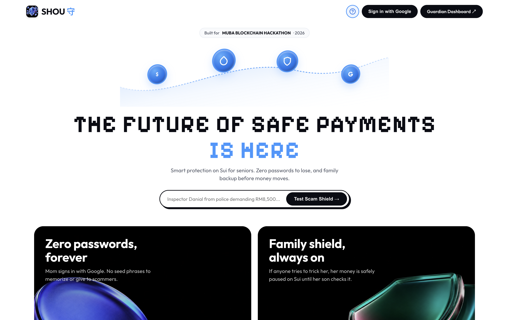
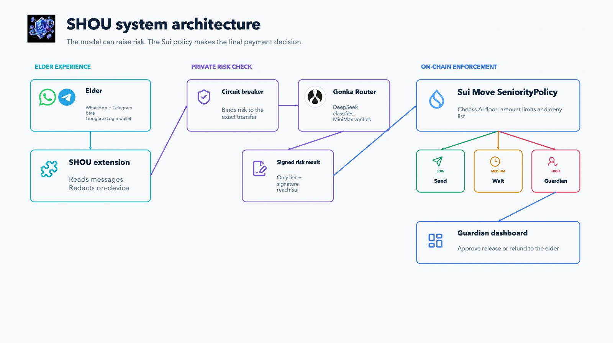

<div align="center">

# 守 SHOU

**S**cam-**H**alting **O**n-chain **U**tility

`守` — *shǒu*, to guard, to keep watch over.

**A Chrome extension that monitors scams passively on WhatsApp and Telegram, backed-up by a stablecoin wallet whose owner writes her own spending rules while she is calm,
and the chain enforces them when she is not.**

MUBA Blockchain Hackathon 2026 · Sui Track 01 (Payments & Stablecoins) · Gonka (AI for Society)

</div>

---

## Screenshots



---

## Executive summary

Elder financial scams are not a detection problem but an **authority** problem: by the
time money moves, the victim has usually already been warned, and sends it anyway
because someone she trusts — or someone impersonating them — is telling her to. That
authority cannot rest with her, because she is being manipulated right now, nor with
her family, who are themselves a documented vector for elder financial abuse — so it
rests with rules she set while calm. SHOU pairs a **Chrome extension** that passively
scores her conversations inside a TEE with an **on-chain policy** that decides how her
money behaves, and the AI's verdict is a floor rather than a ceiling — it can tighten
her limits, never loosen them. Tell the contract a large transfer is low-risk and it
escalates anyway, which is why nobody has to trust our model.

---

## Problem

**She isn't hacked. She's talked into sending it herself — "manufactured consent."**

1. **RM2.97 billion lost to scams in just 11 months of 2025** (67,735 cases). Bank
   Negara Malaysia's 2025 Annual Report puts **95% of Malaysia's online fraud cases**
   as **"authorised transactions"** — the victim approved the transfer herself, no key
   stolen. Bukit Aman CCID logged **RM3.11 billion** in total commercial crime losses
   for 2024 alone, **RM2.45 billion** of it fraud across 37,240 investigation papers.
   Seniors are the sharpest edge of that curve: only **6.4% of victims** (5,533 of
   86,266, 2021–2023) but **20% of total losses** (RM552.5M of RM2.7B) — and by mid-2024
   that gap had widened to **8.3% of victims vs. 27.7% of losses**.

2. **RM1.47 billion from investment scams alone — over half of all losses.** Investment
   scam losses jumped from RM848.6M (6,337 cases) in 2024 to **RM1.47B (9,603 cases) in
   2025**, a ~73% year-over-year rise, with syndicates moving victims from Facebook/
   Instagram into WhatsApp or Telegram "trading groups" before blocking withdrawals.
   Love scams cost **RM45.9M in 2024** (up from RM43.9M in 2023), 75.6% of victims
   women 61+, and **370 cases started on Facebook, 332 on WhatsApp in 2023** — the two
   most common contact points. The US shows the same shape: FBI IC3 logged
   **147,000+ complaints** from adults 60+ in 2024 — more than any other age group —
   for **$4.8–4.9B, up 43% YoY**, averaging **$83,000 per victim**.

3. **70% of victims never report — real losses may hit RM54 billion.** And what does
   get spent goes to the wrong category: banks blocked **RM383M** in fraudulent
   transactions in 2023 alone (**RM780M+** combined 2023–2024), and the National Scam
   Response Centre froze **162,642 mule accounts** in the latest reporting year — none
   of it touching the 95% "authorised transaction" category, because it's all built to
   catch stolen credentials, not manufactured consent. Once sent, instant payment rails
   move funds irreversibly within seconds, and no existing tool sits at that exact
   point: ScamShield/Truecaller warn on known numbers but go silent once a chat moves
   to WhatsApp; BioCatch reads banking-session hesitation, not the conversation that
   caused it. **Nobody else sits in the top-right — blocking it before, at the moment
   money is given away.**

---

## Solution

**A Chrome extension and wallet guardian that protect passively, not reactively —
reading the conversation and halting the money before it moves, instead of flagging
it after.**

An extension that only warns is one more notification to dismiss. A wallet with
spending limits but no awareness of the conversation cannot tell groceries from a
scam. Together, the conversation decides how the money behaves.

### Features

1. **Passive detection.** The extension reads the on-screen WhatsApp Web chat DOM
   automatically — no copy-pasting, no button to press — and shows an inline 🟢/🟡/🔴
   badge. Every message is redacted on-device, then scored via the **Gonka Router**:
   DeepSeek-V4-Flash classifies, MiniMax-M2.7 cross-verifies, and **deterministic
   floors set a risk minimum no model is permitted to talk down.**
2. **Private, tamper-evident scoring.** Scoring happens behind a signing boundary
   built to the AWS Nitro/Nautilus pattern — only a hash, a tier and a signature leave
   the enclave. That signature is verified on-chain in `enclave.move`, so a verdict
   cannot be altered afterwards.
3. **Behavioural circuit breaker → Seniority Mode.** When a flagged conversation
   correlates with an unusual payment, the transfer doesn't fail — it **waits** in
   on-chain escrow, and high-risk transfers require trusted-family co-approval, all
   enforced by `policy.move`, not by our backend.
4. **Safe by construction, seedless by design.** The AI's verdict is a floor, never a
   ceiling. `AdminCap` appears nowhere in `policy.move`, so guardians can block and
   refund a transfer **to her**, never redirect it. zkLogin + Google sign-in removes
   the seed phrase entirely, and a weighted 2·1·1 multisig means she spends alone, her
   son alone cannot, and two relatives together can recover her account.
5. **Truth Score & transparency (Gonka).** Every scored message returns a 0–100% Truth
   Score with an itemised reasoning trace (`urgency`, `authority-impersonation`,
   `financial-solicitation`) and the **Gonka Request ID** for that inference, shown on
   both the extension badge and the guardian dashboard — so what triggered a hold is
   never a black box.

---

## User flow

**Setup (once, while she's calm):** her son installs the extension → she signs in with
Google (zkLogin, no seed phrase) → together they set her spending limits and name her
guardians on the dashboard → they add a recovery circle (weighted multisig).

**Every day (she does nothing differently):** she chats on WhatsApp as usual → a
coloured dot scores each message privately inside the enclave → she sends money the
ordinary way; a small payment lands instantly, exactly as it would without SHOU.

**When something is wrong:** a flagged conversation + an unusual payment → the
transfer holds in on-chain escrow instead of failing → her guardian sees an amount, a
recipient, and what happens if he does nothing (never her messages) → he stops it and
she's refunded in full, or approves it and it goes through.

---

## Tech stack

| Layer | Technology | Why this one |
|---|---|---|
| Policy engine | **Sui Move**, 2024 edition — `policy` · `enclave` · `redflag` | Shared objects let several people act on one wallet without anyone taking custody. |
| Asset | **Testnet USDC** | Elders think in dollars; a guard denominated in a volatile token protects nothing. |
| Client | **@mysten/sui 2.28**, `SuiGrpcClient` | JSON-RPC is deprecated on public fullnodes. |
| Private compute | **Nautilus pattern**, ed25519 + BCS over `node:crypto` | The message is scored where nobody can read it; the chain verifies the enclave's signature itself. |
| Scoring | **Gonka Router** — DeepSeek-V4-Flash classifies, MiniMax-M2.7 cross-verifies | Called from *inside* the enclave, so the privacy claim is a property, not a promise. |
| Sign-in | **zkLogin + Enoki 1.2** | An 80-year-old will not write down twelve words. |
| Recovery | **Weighted multisig** (2·1·1, threshold 2) | The only shape that lets her act alone while still allowing recovery. |
| Detection surface | **Chrome extension, Manifest V3** — TypeScript / esbuild | One content script per site; its only permission is `storage`. |
| Guardian surfaces | **Plain TypeScript + esbuild**, no framework | Three screens over one JSON API — the page holds no key. |
| Tests | **`node:test`** + `sui move test` | 91+ tests across TS and Move; `verify.sh` runs all of them in one command. |

---

## Architecture



The trust boundary: raw message text goes in; only a hash, a tier and a signature come
out. `policy.move` verifies that signature on-chain itself, so the dashboard, driver
and circuit breaker carry the verdict but cannot alter it.

---

## Smart contract addresses (Sui Testnet)

| Contract / Object | Sui Testnet Object ID |
|---|---|
| **Package ID** | `0xdd78bd78aebe0694629773e85e66c37ac8dd9f287d166d052b2656090661ed1f` |
| **SeniorityPolicy** | `0x0cd5e7ccd1f498f0e0148654354f90d1588adde8f4c6d31da221f8c161e5103d` |
| **Community DenyList** | `0x2d84887eb54755afa56a5a0b77256001d6d396aeb89c89db95f858fd3c1dd2fc` |
| **Enclave Registry** | `0xd7c8cb09640080ec692ce505d1da5bb866c7a0fd6da70daea2e913d429de03f2` |
| **Held Escrow Request (Demo)** | `0x29bdc9d2d1f7f884312ff70ccc2cd27fa707147bf2b2585768175baf92e3e976` |
| **Asset Coin Type** | `0xa1ec7fc00a6f40db9693ad1415d0c193ad3906494428cf252621037bd7117e29::usdc::USDC` |
| **Guardian Approver** | `0x4e48678637d9ff9fc151ee5b8083d21910ca280cee592b613addd0b8d9c32ddc` |

View on [SuiVision](https://testnet.suivision.xyz/package/0xdd78bd78aebe0694629773e85e66c37ac8dd9f287d166d052b2656090661ed1f).

---

## Running it

### Option A — Docker (recommended for judges)

```bash
docker compose up
```

- Main Web Experience & Simulator: [http://localhost:3000](http://localhost:3000)
- Guardian Command Dashboard: [http://localhost:4200](http://localhost:4200)
- Chrome Extension Package: [http://localhost:3080/extension.tar.gz](http://localhost:3080/extension.tar.gz)

### Option B — Local development

**Prerequisites:** Node 22+ and the `sui` CLI. Copy `shou/.env.example` to
`shou/.env` and fill in `GONKA_API_KEY`.

```bash
cd shou
for d in enclave packages/*/; do (cd "$d" && npm install); done
./verify.sh          # tests, typechecks, builds
```

```bash
cd shou/enclave                   && SHOU_TEST_SCORER=1 npm start   # :3100
cd shou/packages/circuit-breaker  && npm start                      # :4000
cd shou/packages/zklogin-demo     && npm start                      # :3000
cd shou/packages/dashboard        && npm start                      # :4200
cd shou/packages/extension        && npm run build                  # then load unpacked
```

### Testing the extension (15 seconds)

1. `chrome://extensions` → enable **Developer mode** → **Load unpacked** →
   `shou/packages/extension/dist`.
2. Open `web.whatsapp.com` and watch the badge score live chat.
3. No-install option: use the **Live Web Simulator** at `localhost:3000` with the
   preset scam pills (🚨 Fake Police, 💔 Romance Trap).

---

## Tracks — and why we align

### Sui Track 01 — Payments & Stablecoins

The track names *"stablecoin wallets, treasury, escrow"* as a core idea. `SeniorityPolicy`
and `TransferRequest` **are** that — a stablecoin wallet with programmable, on-chain
controls, not AI with a blockchain bolted on.

| Judging criterion | How SHOU answers it |
|---|---|
| **Product UX** | Google sign-in, not a seed phrase. Guardians see plain English ("someone you trust has to approve"), never a tier number. Weighted recovery means she's never dependent on one relative for daily spending. |
| **Solves a real problem + real-world readiness** | Target user is specific (an elderly parent receiving remittances via WhatsApp/Facebook — the two channels Malaysian police name most often), cited to primary sources above. We state plainly that the production path is the WhatsApp Business API, not DOM scraping. |
| **Technical implementation (complete > complex)** | One vertical slice finished end to end: 91+ tests passing, a real seven-step testnet USDC transfer, five critical security bugs found *and* fixed under adversarial review, every blocker logged in `docs/DECISIONS.md`. |
| **Presentation** | Three demo acts: sign in and score a live message; run the seven-step flow on testnet; tell the contract a large transfer is safe and watch it refuse anyway. |

### Gonka — AI for Society

A live web app (`localhost:3000`) where a message is pasted or read from chat and
returns a verification report, meeting every mandatory requirement:

1. **All AI reasoning runs on the Gonka Network** via the official gateway
   (`api.gonkarouter.io/v1/chat/completions`) — zero third-party AI proxies.
2. **Multi-model consensus:** DeepSeek-V4-Flash (classifier) and MiniMax-M2.7
   (skeptical cross-verifier) see the same redacted message independently; code — not
   a model — computes the final weighted score, with hard floors no model can lower.
3. **Claim extraction:** passive DOM extraction from WhatsApp, or raw text/URL input
   via the simulator.
4. **Truth Score & reasoning trace:** a 0–100% score with itemised reasoning
   (`urgency`, `authority-impersonation`, `secrecy`).
5. **Transparency UI:** both the extension badge and dashboard show the exact **Gonka
   Request ID** for every inference call, proving it ran on Gonka.

**Innovation:** the AI's verdict is a floor, never a ceiling — most AI safety products
fail open; ours degrades to "her own rules still apply," never to "approved." A wrong
or unavailable model raises risk to MEDIUM rather than silently clearing a transfer.

---

## Business model

**The buyer is the bank or e-wallet, not the elder** — regulation turned scam losses
into a direct balance-sheet cost.

- **Target buyers (Malaysia):** ~48 licensed banks + ~47 licensed e-money issuers
  (BNM) = **~95 enterprise buyers**, serving **3.9 million** Malaysians aged 60+ (DOSM).
- **Market size:** SAM of ~1.5–2 million digitally-active senior accounts
  (**RM144M–192M/yr** at the Core tier); realistic SOM of 50,000–100,000 accounts in
  Year 1–2 via 3–5 pilot banks (**RM4.8M–9.6M ARR**).
- **Pricing — Per Active Guarded Account (PAGA):** Standard RM6/mo, Core RM8/mo,
  Premium RM12/mo — following the active-account pricing norm set by BioCatch/SHIELD.
- **Unit cost:** ~**RM2.00/account/month**, blended from published 2025/26 rate cards
  (Gonka-class LLM inference, AWS Nitro EC2, Sui gas, WhatsApp Business API messaging)
  — nothing invented.
- **Gross margin:** 67% (Standard) → 83% (Premium); target 75–80% at the Core tier,
  in line with standard SaaS benchmarks.
- **The pitch:** a single UK-style reimbursement claim costs a bank up to
  **RM463,000 (£85,000)**. At RM8/account/month (RM96/year), that claim value covers
  **4,800+ guarded-account-years** of protection. A bank isn't buying software — it's
  buying an insurance policy that costs less than the deductible.
- **Buying trigger:** Malaysia's 2026 e-wallet compensation rule (7-working-day
  reimbursement, applies even with partial victim fault) plus SEFT shared-accountability
  enforcement since October 2024 — an active, budgeted mandate, not a hypothetical need.

---

## Regulatory & compliance

- **Malaysia:** BNM's 2026 rule requires e-wallet providers to fully compensate scam
  victims within **7 working days** if fraud safeguards weren't met — even where the
  victim is partly responsible (announced by PM Anwar Ibrahim in Parliament). SEFT's
  shared-accountability regime has applied since October 2024.
- **Singapore's Shared Responsibility Framework** (live 16 Dec 2024): banks bear the
  **full** scam loss if they breached a duty — including real-time fraud surveillance
  and a post-login cooling-off period — with **no liability cap**.
- **UK PSR APP fraud regime** (live 7 Oct 2024): sending and receiving banks split
  losses **50/50**, mandatory reimbursement within **5 business days**, up to
  **£85,000** per claim, covering 99.8% of claims by volume.
- **Licensing posture:** SHOU is a technology partner, not a bank or e-wallet — no
  banking licence required. Licensed financial institutions retain responsibility for
  KYC, AML and transaction monitoring under BNM's rules.
- **Data privacy (PDPA):** messages are redacted and scored on the user's device and
  inside the enclave; banks receive a risk tier and signature, **never the message
  content** — no PDPA exposure on our side.
- **Custody position:** non-custodial by construction — `AdminCap` appears nowhere in
  `policy.move`, keeping SHOU outside money-transmitter treatment.
- **WhatsApp ToS:** the prototype reads WhatsApp Web's DOM for demo purposes only,
  which is not ToS-compliant for production; the commercial path is the official
  **WhatsApp Business API**, stated openly rather than glossed over.

---

## What's now, what's next

**Built & tested today:** live end-to-end testnet USDC transfer · enclave scoring +
on-chain circuit breaker · seedless/gasless zkLogin + Enoki onboarding · Seniority
Mode (weighted 2·1·1 multisig) enforced on-chain.

**What's next:**

1. **AWS Nitro attestation** — close the key-provenance gap with real hardware proof.
2. **WhatsApp Business API** — compliant, ToS-safe messaging channel for production.
3. **Guardian dashboard + UI polish** — full front-end ready for real users, with
   Enoki-sponsored transactions so neither elder nor guardian holds SUI.
4. **Bank pilot → mainnet** — piloting with a real bank against BNM's liability-shift
   rules.

---

## Honest limitations

- **No Nitro instance yet.** Signature verification is real; key provenance is
  currently asserted by us, not proven by AWS hardware.
- **Only two of three candidate models are in the live path.** Kimi-K2.6 was excluded
  on measured latency (median 26.5s against a 14s deadline), not quality.
- **WhatsApp and Telegram DOM reading is demo-only**, not ToS-compliant for production — see
  Regulatory & Compliance above.

---

## Team — TEAM WEB 1.5

1. **Daniel anak Boniface Alin** — Research, business and financial value, target users, statistics, regulatory.
2. **Hana Tang** — Overall planning, Move contracts, TEE enclave, driver SDK, zkLogin and recovery.
3. **Shermaine Yap Shi Min** — Gonka Router integration, Chrome extension, guardian dashboard.
4. **Liaw Yi Wen** — Research, business and financial value, target users, statistics, regulatory.

*MUBA Blockchain Hackathon 2026 · Sui Track 01 (Payments & Stablecoins) · Gonka (AI for Society)*