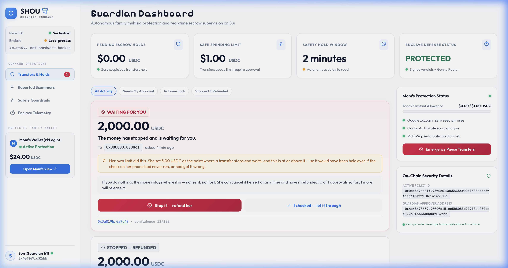

<div align="center">

# 守 SHOU

**S**cam-**H**alting **O**n-chain **U**tility

`守` — *shǒu*, to guard, to keep watch over.

**A stablecoin wallet whose owner writes her own spending rules while she is calm,
and the chain enforces them when she is not.**

MUBA Blockchain Hackathon 2026 · Sui Track 01 (Payments & Stablecoins) · Gonka (AI for Society)

</div>

---

## Executive summary

Elder financial scams are not a detection problem but an **authority** problem: by the
time money moves the victim has usually already been warned, and sends it anyway
because someone she trusts is telling her to. That authority cannot rest with her —
she is being manipulated right now — nor with her family, who are a leading vector for
elder financial abuse, so it rests with rules she set while calm. SHOU pairs a **Chrome
extension** that passively scores her conversations inside a TEE with an **on-chain
policy** that decides how her money behaves, and the AI's verdict is a floor rather
than a ceiling — it can tighten her limits, never loosen them. Tell the contract a
large transfer is low-risk and it escalates anyway, which is why you do not have to
trust our model.

**Status:** wallet guardian deployed to Sui testnet — 99 tests passing, five critical
security bugs found and fixed, a seven-step end-to-end run in real USDC. Scoring,
redaction, the enclave, the Chrome extension and the guardian dashboard are all built.
The elder-facing browser demo signs verdicts but does not yet submit them on-chain; the
enclave runs as a local process rather than in real Nitro hardware. Both gaps are marked
where they appear below. ([details](docs/DECISIONS.md))


## Screenshots

<div align="center">
  
  
</div>

| Image | Description |
|---|---|
| `docs/img/grandma-shield.png` | Quiet background protection while Mom chats naturally on WhatsApp |
| `docs/img/04-dashboard.png` | Guardian Command Dashboard: Held transfers in escrow, 1-Click Stop & Refund |
| `docs/img/architecture.png` | Full system architecture: Enclave, Gonka Router, Circuit Breaker, and Sui Move |

---

## Problem

**A disproportionate share of the money, from a shrinking share of the victims.**

- **United States (FBI IC3, 2024):** adults 60+ filed the most fraud complaints of any
  age group — 147,000+ — and reported **$4.8–4.9B in losses, up 43% year over year**.
  Crypto-related scams alone cost this group **$2.8B**. Average loss per victim:
  **$83,000**.
  [AARP](https://www.aarp.org/money/scams-fraud/fbi-report-fraud-2024/) ·
  [TRM Labs](https://www.trmlabs.com/resources/blog/a-record-breaking-year-for-cybercrime-key-findings-from-the-fbis-2024-ic3-report)

- **Malaysia (Bukit Aman):** senior citizens lost **RM552.5M to online scams between
  2021 and 2023** across 5,533 victims — fewer victims than other age groups, but a
  far larger loss each.
  [FMT](https://www.freemalaysiatoday.com/category/nation/2024/05/27/senior-citizens-lost-half-a-billion-ringgit-to-online-fraud-over-3-years)

- **2024 was the worst year in five.** RM40.6M in elderly financial-scam losses.
  Love scams targeting elderly women alone reached **RM45.9M**, up from RM43.9M in
  2023 — and **Facebook and WhatsApp are the two most common contact points**.
  [Malay Mail](https://www.malaymail.com/news/malaysia/2025/01/10/lonely-hearts-exploited-love-scams-prey-on-elderly-women-causing-rm459m-in-losses-in-2024-facebook-whatsapp-apps-of-choice-to-find-victims/162742)

The pattern in every one of these: the victim authorised the transfer herself. No
key was stolen. Existing defences target theft, and this is not theft — it is
consent, manufactured under pressure.

---

## Solution

**A Chrome extension and wallet guardian that protect passively, not reactively.**

An extension that only warns is one more notification to dismiss. A wallet with
spending limits but no awareness of the conversation cannot tell groceries from a
scam. Together, the conversation decides how the money behaves.


**1 · Passive detection.** The extension reads the on-screen chat DOM automatically —
no copy-pasting, no button to press — and shows an inline 🟢/🟡/🔴 badge. **WhatsApp Web
is the supported and demonstrated surface.** Messenger and Telegram Web adapters also
ship and are unit-tested against fixtures, but neither has been run against the live
site, so treat them as best-effort rather than proven integrations. Every message goes to a Gonka Router classifier, then to a
second model for cross-verification if the shared deadline allows, and
**deterministic rules set floors that no model is permitted to talk down**.

**2 · Private and tamper-evident.** Scoring happens behind a signing boundary built to
the AWS Nitro / Nautilus pattern — only a hash, a tier and a signature leave, and PII is
stripped on her own device before scoring. That hash is anchored on-chain inside the
signed attestation, so a verdict cannot be altered afterwards without invalidating the
signature.

> **What is and is not proven today.** The signature and the redaction are real and
> checkable. The *hardware* is not: this build runs the enclave as an ordinary local
> process, and `/get_attestation` returns `attestationDocument: null`, exactly as it is
> written to. Deploying the same binary into a Nitro enclave is what turns the pattern
> into a hardware guarantee, and that step has not been done. Read every "TEE" in this
> document as "the enclave boundary, software-enforced today".

**3 · Behavioural circuit breaker into Seniority Mode.** When a live flagged
conversation correlates with an unusual payment, the transfer does not fail — it
**waits**, and high-risk transfers require trusted-family co-approval, enforced as an
on-chain Sui policy rather than by our backend. Reported scammers get a **soft ban**
that blocks suspicious amounts while still allowing daily necessities. The soft ban is
implemented and unit-tested in `redflag.move`; note that **no address has been reported
on the live deny list**, because reporting requires an `OracleCap` that the demo signer
does not hold — so the community tab is genuinely empty rather than showing seeded data.

**4 · Safe by construction.** The AI's verdict is a floor, never a ceiling. Guardians
can block a transfer and refund it **to her**, but never redirect it to themselves.
`AdminCap` appears nowhere in `policy.move`, so there is no code path by which we touch
her funds — and because zkLogin has no seed phrase, funds sit behind a weighted
multisig where she acts alone, her son alone cannot, and two relatives together can
recover.

Layers 1–2 are the Sui submission; layers 0 and 3 are the Gonka submission. The Red
Flag evidence-review UI is the one piece still in progress; the extension and the
dashboard are built.

---

## User flow

### Setup — once, together, while she is calm

**1 · Install the extension.** Her son loads SHOU into Chrome on her laptop.
Nothing is asked of her yet.

**2 · She signs in with Google.** One button. zkLogin derives a Sui wallet
address from her Google account, so there is no twelve-word phrase to write on
a Post-it, lose, or read out to a stranger on the phone.

**3 · They set her rules together, on the dashboard.** She chooses her own
limits — a small everyday amount that just goes through, a middle band that
waits out a cooling-off period, and a ceiling above which someone she trusts
has to agree. She names her guardians and how many of them must agree. This
becomes a `SeniorityPolicy` on chain, and it is the last time anyone decides
anything under pressure.

**4 · They add a recovery circle.** Her wallet is a weighted multisig: she
spends alone, her son alone cannot, and if her Google account is ever lost two
relatives together can bring the funds back.

Setup is over. She is never asked to do any of it again.

### Every day — she does nothing differently

**5 · She chats as usual.** WhatsApp Web (the demonstrated surface; Messenger and
Telegram Web adapters ship but are unverified against the live site).
No button to press, no message to copy anywhere.

**6 · A coloured dot appears beside each message.** 🟢 normal, 🟡 be careful,
🔴 this is a scam. The message is stripped of names and numbers on her own
laptop, then scored inside an enclave, so the text never sits anywhere readable
— not on our servers, not in a log.

**7 · She sends money the ordinary way.** Recipient, amount, send. A small
payment to the coffee shop lands immediately, exactly as it would without us.

> **Which surface does which half.** Steps 5–7 are live in the browser demo and the
> extension: the message is really scored and the enclave really signs a verdict bound
> to that exact policy, recipient and amount. Steps 8–10 are on-chain, and the browser
> demo **stops at the signature** — it does not submit, so no escrow appears on the
> guardian dashboard from clicking "send" there. The on-chain half is real but is driven
> by `packages/driver/src/e2e.ts`, which moves actual testnet funds through escrow,
> refusal and release. Wiring the browser page to submit is the one seam left open.

### When something is wrong — the part that matters

**8 · The money stops instead of failing.** If the conversation she is in was
scored 🔴, or the amount is above her own ceiling, the transfer does not bounce
with an error she will retry around. It goes into escrow on chain and waits.
Her balance is not gone; it is held.

**9 · Her son sees it on his dashboard.** An amount, a recipient, and what
happens if he does nothing. He never sees her messages — the dashboard has no
route to them at all.

**10 · He stops it, and she is refunded in full.** The contract only ever pays
an escrow back to her. There is no code path, for him or for us, that sends it
anywhere else. If he thinks it is fine, he approves and it goes through
instead; if he never answers, she can cancel it herself and get her money back.

### What she cannot be talked out of

A scammer's next move is *"the app is lying, auntie, send it anyway"* — so the
rules above are not advice she can dismiss:

- Retrying a held transfer is refused by the chain, not by a dialog.
- A large amount escalates on its own even if our model calls it safe, so you
  do not have to trust the model.
- An address reported as a scammer stops large payments while still letting her
  buy groceries.

SHOU is a guardrail, not a cage: you cannot be non-custodial *and* make it
impossible to spend your own money. Every path ends with her money either
delivered or back with her.

---

## Tech stack

| Layer | Technology | Why this one |
|---|---|---|
| Policy engine | **Sui Move**, 2024 edition — `policy` · `enclave` · `redflag` | Shared objects let several people act on one wallet without anyone taking custody. Capabilities let us model "may block" separately from "may spend". |
| Asset | **Testnet USDC** | Elders think in dollars. A guard denominated in a volatile token protects nothing. |
| Client | **@mysten/sui 2.28**, `SuiGrpcClient` | JSON-RPC is deprecated on public fullnodes — we were on 1.45 and had to migrate mid-build. |
| Private compute | **Nautilus pattern**, ed25519 + BCS over `node:crypto` | The message is scored where nobody can read it; the chain verifies the enclave's signature itself. No SDK in the signing path — the bytes the enclave signs are the bytes Move reconstructs. |
| Scoring | **Gonka Router** — DeepSeek classifies, MiniMax cross-verifies | Called from *inside* the enclave. If the extension called it directly the message would leave the device unprotected, and the privacy claim would be a promise rather than a property. |
| Sign-in | **zkLogin + Enoki 1.2** | An 80-year-old will not write down twelve words. Enoki carries the salt, whose loss would destroy the address permanently. |
| Recovery | **Weighted multisig** (2·1·1, threshold 2) — *address derivation only* | Weights, not counts — the only shape that lets her act alone while still allowing recovery. The address is derived and shown on the sign-in page and covered by 6 tests; **no funds are held at it and no recovery transaction is implemented**, so this is a demonstrated construction, not a working recovery path. |
| Detection surface | **Chrome extension, Manifest V3** — TypeScript bundled by esbuild | A service worker, one content script per site, a popup and an options page. Its only permission is `storage`, and its only hosts are our two localhost ports: it can read the chat tab it is injected into and talk to us, and reach nothing else. |
| DOM adapters | **One file per site**, tested against **linkedom** | These clients ship obfuscated, frequently-rebuilt class names, so the fragile part is quarantined in `adapters.ts` and the logic above it is unit-tested on parsed fixtures rather than a live page. WhatsApp: 14 fixture tests **and live confirmation**. Messenger: 8 fixture tests, no live confirmation. Telegram Web: 10 fixture tests covering both the `/k/` and `/a/` clients, no live confirmation. |
| Guardian surfaces | **Plain TypeScript + esbuild**, no framework | Three screens over one JSON API: the held-transfer list, the community deny list (read-only), and policy setup. The page holds no key and imports no Sui SDK — its server makes every call — so there is one place where an on-chain mutation can happen and one place to guard it. |
| Services | **Node 22 `node:http`**, TypeScript run directly via `--experimental-strip-types` | Four servers, zero web frameworks and no build step to run one. The whole repo's runtime dependency list is `@mysten/sui` and `@mysten/enoki`; nothing else ships. |
| Tests | **`node:test`**, 91 across TS + 38 in `sui move test` | Built in, so a suite is one file and no runner config. |

---

## Smart Contract Addresses (Sui Testnet)

All smart contracts are deployed and verified on **Sui Testnet**:

| Contract / Object | Sui Testnet Object ID | Explorer Link |
|---|---|---|
| **Package ID** | `0xdd78bd78aebe0694629773e85e66c37ac8dd9f287d166d052b2656090661ed1f` | [View on SuiVision](https://testnet.suivision.xyz/package/0xdd78bd78aebe0694629773e85e66c37ac8dd9f287d166d052b2656090661ed1f) |
| **SeniorityPolicy** | `0x0cd5e7ccd1f498f0e0148654354f90d1588adde8f4c6d31da221f8c161e5103d` | [View on SuiVision](https://testnet.suivision.xyz/object/0x0cd5e7ccd1f498f0e0148654354f90d1588adde8f4c6d31da221f8c161e5103d) |
| **Community DenyList** | `0x2d84887eb54755afa56a5a0b77256001d6d396aeb89c89db95f858fd3c1dd2fc` | [View on SuiVision](https://testnet.suivision.xyz/object/0x2d84887eb54755afa56a5a0b77256001d6d396aeb89c89db95f858fd3c1dd2fc) |
| **Enclave Registry** | `0xd7c8cb09640080ec692ce505d1da5bb866c7a0fd6da70daea2e913d429de03f2` | [View on SuiVision](https://testnet.suivision.xyz/object/0xd7c8cb09640080ec692ce505d1da5bb866c7a0fd6da70daea2e913d429de03f2) |
| **Held Escrow Request (Demo)** | `0x29bdc9d2d1f7f884312ff70ccc2cd27fa707147bf2b2585768175baf92e3e976` | [View on SuiVision](https://testnet.suivision.xyz/object/0x29bdc9d2d1f7f884312ff70ccc2cd27fa707147bf2b2585768175baf92e3e976) |
| **Asset Coin Type** | `0xa1ec7fc00a6f40db9693ad1415d0c193ad3906494428cf252621037bd7117e29::usdc::USDC` | Testnet USDC |
| **Guardian Approver** | `0x4e48678637d9ff9fc151ee5b8083d21910ca280cee592b613addd0b8d9c32ddc` | Active Approver 1/1 |
| **Simulated Scammer** | `0x00000000000000000000000000000000000000000000000000000000000000c1` | Intercepted Target |

---

## Blockchain Technology Used

SHOU leverages the unique primitives of the **Sui Network (L1)** and **Sui Move (2024 Edition)** to turn decentralized AI inference into binding financial protection:

1. **Sui Move 2024 Edition Smart Contracts:**
   - `policy.move` — **SeniorityPolicy & TransferRequest:** Encapsulates the user's spending boundaries (`everyday_limit`, `cooldown_limit`, `guardian_threshold`). When risk is detected, funds are held in escrow on-chain rather than bounced.
   - `circuit_breaker.move` — **Behavioral Circuit Breaker:** Connects off-chain AI scores to on-chain state machines. Enforces three deterministic tiers: `LOW` (instant), `MEDIUM` (mandatory cooldown timer), and `HIGH` (held in escrow until guardian co-approval or refund).
   - `redflag.move` — **Decentralized DenyList:** On-chain registry of verified scammer addresses managed via `OracleCap`. Enforces soft bans that block large suspicious transactions while allowing basic necessities.
   - `enclave.move` — **On-Chain Attestation & Ed25519 Verification:** Directly verifies BCS-serialized cryptographic signatures from the TEE enclave, ensuring the AI Truth Score was produced under tamper-evident hardware guarantees and cannot be modified by intermediaries.

2. **zkLogin (Zero-Knowledge OAuth Authentication):**
   - Eliminates seed phrases completely by deriving an on-chain Sui address directly from the user's Google account using ephemeral keypairs and zero-knowledge proofs.
   - Prevents the catastrophic elder vulnerability of writing recovery phrases on paper or reading them to phone scammers.

3. **Weighted Multi-Signature Recovery (2·1·1 Threshold-2 Multisig):**
   - Eliminates single points of failure without introducing family coercion.
   - **Weight distribution:** Mother = 2, Son = 1, Daughter = 1 (Threshold = 2).
   - The mother spends alone (weight 2 ≥ 2). The son alone cannot touch her funds (weight 1 < 2). If her account is lost or compromised, two relatives can jointly recover the account (1 + 1 = 2).

4. **Programmable Transaction Blocks (PTB) & USDC Stablecoins:**
   - Composes policy checks, escrow creation, and token transfers in single atomic transactions.
   - Denominated in **Testnet USDC** (`0xa1ec...::usdc::USDC`), protecting elders in dollar-pegged purchasing power rather than volatile speculative tokens.

---

## GonkaRouter Track: AI for Society

### 1. Challenge Overview

The **AI for Society** challenge focuses on real-world applications of AI in the public domain, encouraging participants to utilize the **Gonka Network** to create tools with genuine value for everyday users.

Among the recommended directions, **AI Fact Checker** is highlighted as a preferred application:
> *"What you are building is a decentralized 'Truth Engine' that uses multi-model AI inference to verify the authenticity of news, social media claims, or digital media in real-time... In an era of deepfakes and AI-generated misinformation, centralized fact-checkers are often accused of bias. This challenge tasks you with using Gonka’s decentralized network to provide a neutral, verifiable, and transparent source of truth."*

### 2. How SHOU Transforms the "Fact Checker" into an "Active Truth Engine"

Traditional fact-checkers suffer from an **authority and actuation failure**:
- When an elderly victim is actively being defrauded by an impersonation scammer on WhatsApp (e.g. fake police officer or romantic interest), **showing an informative fact-check label does not stop the transfer**. The victim has already been psychologically coerced into dismissing warnings.
- **SHOU builds an Active Decentralized Truth Engine:** It cross-verifies claims, statements, and conversations in real time using Gonka Router inference, computes an on-chain verifiable **Truth Score (0–100%)**, and directly binds that score to a **Sui Move Web3 circuit breaker**. If the claim is fraudulent, the money is physically prevented from leaving her wallet.

```
   ┌─────────────────────────────────────────────────────────────────────────────┐
   │                        HACKATHON REQUIREMENT MAPPING                        │
   ├───────────────────────────────┬─────────────────────────────────────────────┤
   │ Hackathon Criteria            │ How SHOU Fulfills It                        │
   ├───────────────────────────────┼─────────────────────────────────────────────┤
   │ Real-World Public Value       │ Financial protection for elderly against    │
   │                               │ imposter, romance, and threat scams.        │
   ├───────────────────────────────┼─────────────────────────────────────────────┤
   │ Gonka Router (Mandatory)      │ Official gateway: api.gonkarouter.io/v1     │
   │                               │ All inference & scoring runs on Gonka.      │
   ├───────────────────────────────┼─────────────────────────────────────────────┤
   │ Multi-Model Consensus         │ DeepSeek-V4-Flash (Primary Classifier) +    │
   │                               │ MiniMax-M2.7 (Cross-Verifier) with          │
   │                               │ deterministic conflict resolution logic.    │
   ├───────────────────────────────┼─────────────────────────────────────────────┤
   │ Claim Extraction              │ Passive on-screen chat DOM extraction       │
   │                               │ (WhatsApp/Telegram) and text snippet input. │
   ├───────────────────────────────┼─────────────────────────────────────────────┤
   │ Truth Score & Reasoning Trace │ Computes 0-100% Risk/Truth score with       │
   │                               │ transparent reasons (urgency, fake badges). │
   ├───────────────────────────────┼─────────────────────────────────────────────┤
   │ Transparency & Request IDs    │ Gonka Request IDs displayed on UI to prove  │
   │                               │ inference occurred on Gonka's network.      │
   ├───────────────────────────────┼─────────────────────────────────────────────┤
   │ Web3 Circuit Breaker (Sui)    │ Binds AI Truth score cryptographically to   │
   │                               │ on-chain escrow hold instead of raw advice. │
   └───────────────────────────────┴─────────────────────────────────────────────┘
```

### 3. Technical Requirements

#### Mandatory: Gonka Router Integration (Required)
- All AI reasoning and claim verification logic runs on the **Gonka Network** via the official inference gateway (`https://api.gonkarouter.io/v1/chat/completions`).
- Implemented in [`shou/packages/gonka-client/src/scorer.ts`](file:///Users/yihui/Documents/muba2026/shou/packages/gonka-client/src/scorer.ts).
- Uses `Bearer $GONKA_API_KEY` authentication, routing requests with zero third-party centralized AI proxies.

#### Multi-Model Consensus & Neutral Cross-Verification
To ensure neutrality, prevent hallucinations, and resist prompt injections:
1. **Primary Model — DeepSeek-V4-Flash (`deepseek-ai/DeepSeek-V4-Flash-0731`):**
   - Rapidly performs **Claim Extraction** and categorizes behavioral indicators: authority impersonation, manufactured panic, and illicit payment requests.
2. **Secondary Cross-Verifier — MiniMax-M2.7 (`MiniMaxAI/MiniMax-M2.7`):**
   - Independently reviews the claim and context to cross-verify the presence of psychological coercion, secrecy demands (*"do not tell your family"*), and financial risk.
3. **Consensus Logic & Conflict Resolution:**
   - If both models agree (e.g., both identify high fraud probability), confidence is maximal.
   - If models disagree, SHOU applies a **fail-safe consensus algorithm**: safety rules take precedence, setting an uncompromised risk floor so that potential scams are held for human guardian review rather than allowed through.

#### Core Functionality
- **Claim Extraction:** The Chrome extension passively extracts message nodes from the live DOM (WhatsApp Web / Telegram Web), redacts PII locally, and prepares claim strings for verification. The Web Simulator also accepts any raw text snippet or scenario.
- **Decentralized Verification:** Gonka-hosted models analyze the claims against behavioral threat taxonomies and fraud patterns.
- **Truth Score & Reasoning Trace:** Outputs an objective **Truth / Risk Score (0–100%)** accompanied by an itemized reasoning trace (e.g. `urgency`, `authority-impersonation`, `financial-solicitation`).
- **Transparency UI & Gonka Request IDs:** Both the Chrome extension badge and the Guardian Command Dashboard display the exact **Gonka Request ID** (e.g. `gonka-req-9f8a2...`), proving that inference was executed trustlessly on Gonka.ai.

### 4. Developer Tips & Best Practices Addressed

- **The "Neutrality" Prompt:** System prompts are strictly objective and forensic, instructing the models to analyze textual evidence without emotional rhetoric or assumed guilt.
- **Cross-Model Comparison:** Multi-model pipeline cross-examines findings between DeepSeek and MiniMax, logging individual assessments before combining them.
- **On-Chain Proof:** The Gonka verification verdict and Request ID are hashed alongside the transfer parameters (`policy_id`, `recipient`, `amount`) inside the TEE enclave, signed, and validated on-chain in `enclave.move` and `policy.move`.

### 5. Submission Criteria & Verification

- **Live Demo Web App:** Accessible at `http://localhost:3000` (Docker) or via our public deployment, featuring the interactive Multi-Model Simulator, Google zkLogin, and live claim tester.
- **GitHub Repository:** Clean, modular TypeScript and Move codebase with extensive unit tests (`verify.sh`) and documentation.
- **Pitch Video:** Demonstrates a live fact-check of an active scam message on WhatsApp, multi-model consensus on Gonka Router, and the resulting on-chain escrow halt on Sui.

---

### How it fits together


The dashed box is the trust boundary. Raw message text goes in; only a hash, a tier and
a signature come out — which is why Gonka is called from *inside* it rather than from the
extension. `policy.move` then verifies that signature on-chain itself, so the circuit
breaker and driver carry the verdict but cannot alter it.

Everything in this diagram is built and running. Three surfaces added after the
diagram was drawn are not yet in the image, so they are named here rather than
implied: the **guardian dashboard** reads `SeniorityPolicy` and every
`TransferRequest` through the driver and calls `policy::approve` /
`policy::block_and_refund`; the **community deny list** view reads the `DenyList`
table through the driver and writes nothing; and **policy setup** calls
`policy::create_policy`. All three sit on the driver, to the right of the trust
boundary — none of them can see a message, and the dashboard server has no code path
to the enclave or the circuit breaker at all.

### Project structure

```
muba2026/
├── README.md
├── docs/                       DECISIONS · RUNBOOK · DEMO · architecture · PRD
└── shou/
    ├── move/
    │   ├── sources/            policy.move · redflag.move · enclave.move
    │   └── tests/              38 Move tests
    ├── enclave/src/            TEE server, attestation, BCS layout
    └── packages/
        ├── driver/             Sui SDK client, e2e + demo scripts, shared interface
        ├── circuit-breaker/    correlates conversation risk with transfers
        ├── gonka-client/       classifier + verifier scorer, deterministic floors
        ├── redact/             PII stripping
        ├── extension/          Chrome extension — passive DOM scoring, inline badge
        ├── dashboard/          guardian dashboard — held transfers, deny list, policy setup
        └── zklogin-demo/       sign-in, recovery multisig, transfer panel
```

The seam between developers is `packages/driver/src/types.ts` — the interface the
dashboard and extension code against.

---

## Track alignment

**Sui — Track 01.** The track's ideas list names *"stablecoin wallets, treasury,
escrow"*. `SeniorityPolicy` and `TransferRequest` are a literal description of that —
a stablecoin wallet with programmable controls, not AI with a blockchain attached.

**Gonka — AI for Society.** Conversation scoring and Red Flag evidence review are
Layers 0 and 3, not a bolt-on. Passive detection instead of reactive self-report is
the part that does not already exist.

**Deliberately decoupled.** Layers 0 and 3 need zero Sui code to demo; Layers 1 and 2
need zero Gonka calls, because the tier logic accepts a risk score regardless of who
produced it. Two submissions, two complete demos, one build.

---

## Judging criteria — how we answer each one

### Sui, Track 01

**Commercial viability** — *weighted heaviest*

The buyer is the bank or e-wallet, not the elder, and the reason is a regulatory
change that happened last year rather than a market we hope will appear. Singapore's
Shared Responsibility Framework and the UK's PSR reimbursement rules made scam losses
a **direct balance-sheet cost** to financial institutions, with no liability cap in
Singapore. SHOU is the "real-time fraud surveillance plus cooling-off period" duty from
that framework, productised and sold per guarded account. A bank buys it to reduce
reimbursement exposure it now carries by law — not out of goodwill. Full detail in
[Business value](#business-value-and-revenue-model) below.

**Solves a real problem, and is ready for the real world**

Target user is specific: an elderly parent who receives money from family, most often
a working-abroad adult child, and is contacted through Facebook or WhatsApp — the two
channels Malaysian police name as the most common. The numbers are cited to primary
sources in [Problem](#problem). We do not claim readiness we do not have: the WhatsApp
production path is the Business API, not DOM scraping, and that is stated rather than
glossed.

**Technical implementation — complete over complex**

One vertical slice is finished end to end rather than four sketched:

- Deployed to testnet, **91 tests passing** (38 Move, 6 multisig, 7 redaction, 6 session,
  22 extension, 12 scoring), and `shou/verify.sh` runs all of them plus the live
  scoring path in one command
- A **seven-step end-to-end run moving real testnet USDC**, not a mock
- **Five critical security bugs found and fixed** under adversarial review, each with a
  regression test — including a fund-theft bug in our own deployed contract, provable
  live: calling `policy::execute` directly now fails with `NonEntryFunctionInvoked`
- Every blocker and its resolution written down in [docs/DECISIONS.md](docs/DECISIONS.md)

**Product UX**

Sign-in is Google, not a seed phrase, because the user will not manage one. The
guardian sees plain English — *"someone you trust has to approve before any money
moves"* — never a tier number. Recovery is weighted so she is never dependent on a
relative for day-to-day spending. Where the model returns nothing, the screen says so
rather than inventing a confident-looking score.

**Presentation — let the judge visualise it**

The demo is three acts: sign in and score a live message; run the seven-step flow
against testnet; then **tell the contract a large transfer is safe and watch it refuse
anyway**. That last one is 45 seconds and needs no browser. Flow in
[docs/DEMO.md](docs/DEMO.md).

**Regulatory and compliance**

> **TODO — being researched by the team.** Drop findings here.
>
> Already documented: the Singapore and UK liability shifts (above); WhatsApp's ToS
> prohibiting automated access to the consumer client, with the Business API as the
> compliant production path; and the custody position — non-custodial by construction,
> since `AdminCap` appears nowhere in `policy.move`, which keeps us outside
> money-transmitter treatment.

### Gonka — AI for Society

**Solves a real problem, and is ready for the real world**

Same problem, same cited numbers. The AI does the part software is actually good at —
reading every message without getting tired — while the irreversible decision stays
with rules a human set in advance.

**Innovation and niche**

Three things we have not seen combined elsewhere:

1. **Passive detection, not self-report.** Every deployed tool requires the victim to
   suspect something and go check. A person being actively manipulated does not do
   that. Scoring runs on the conversation as it arrives.
2. **The AI's verdict is a floor, never a ceiling.** It can escalate a transfer; it can
   never de-escalate one. Almost every AI safety product fails open — ours cannot lower
   a limit the user set herself, so a wrong or compromised model degrades to "her own
   rules still apply" rather than to "approved".
3. **The model's verdict is signed at the enclave boundary**, and a blockchain then
   verifies that signature independently — `shou::enclave` checks the ed25519 signature
   over the exact BCS bytes, so a verdict cannot be edited after the fact. Redaction is
   applied on her device before anything is sent, and again on arrival. The part that is
   *not* yet proven is the hardware: this build runs the enclave as a local process
   (`attestationDocument: null`), so "the message never leaves the enclave" is an
   architectural property of the code today, and becomes a hardware guarantee only once
   the same binary is deployed into a Nitro enclave.

**Use of different models**

Not a model list, and not a vote — **two models in distinct roles, with code owning
the final number.**

**DeepSeek-V4-Flash is the classifier** (median 2.6s), and **MiniMax-M2.7 is a
skeptical second reviewer** (median 19.6s) that sees the same redacted message but not
the classifier's answer, so a gap between them is real disagreement rather than
anchoring. Both calls share one **14-second wall-clock deadline**, because a user is
watching a badge: if under 4s remain when the classifier returns, the second opinion is
skipped and the output says *"not cross-verified"* rather than spending the rest of the
budget and returning nothing.

**The calls are sequential, deliberately.** Issued concurrently this router returns
HTTP 429, and when it does not 429 it throttles — the same DeepSeek call measured
2,472ms alone and 17,560ms alongside one other request. Parallelism costs roughly 7x
here and buys nothing, so the obvious `Promise.all` shape is exactly wrong.

**Code computes the score, not a model.** A weighted blend (classifier 0.35, verifier
0.2, deterministic indicators 0.2) renormalises over whoever actually answered, so a
model that fails drops out instead of dragging the average toward zero. Over that sit
**hard floors no model can lower**: a credential request floors at 85, the
authority + urgency + secrecy signature of a Macau scam at 80, authority + urgency at
70. And if *every* model fails, anything scoring above 15 on deterministic rules alone
is raised to 40 — the MEDIUM line — so an outage holds a transfer for review instead of
silently clearing it.

Every state that is not a clean two-model run is **named on screen**: `not
cross-verified`, `classifier unavailable`, `the two models disagreed by N points`,
`held for review rather than cleared, because no model was available`. Each call's
Gonka Request ID is retained and rendered in the UI beside the Truth Score and the
reasoning trace, in the shape Gonka asks for.

> **Kimi-K2.6 is deliberately not in the live path.** It was excluded on measured
> latency — median 26.5s, never once under 23s across five novel prompts, against a
> 14-second deadline. Re-checked on 3 Sep 2026 it no longer answers this router at all:
> a bare *"reply ok"* prompt returned **HTTP 524 after 126s**, and a 60s attempt
> returned nothing. Two models is the deliberate shape, not an unfinished three. Figures
> are recorded at the top of
> [packages/gonka-client/src/scorer.ts](shou/packages/gonka-client/src/scorer.ts); the
> wider latency investigation is in
> [shermaine-gonka/LATENCY-FINDINGS.md](shermaine-gonka/LATENCY-FINDINGS.md).

---

## Business value and revenue model

**The buyer is the bank or e-wallet, not the elder.** Regulation turned elder-scam
losses from "sad, but not our liability" into a direct balance-sheet cost:

- **Singapore's Shared Responsibility Framework** (live 16 Dec 2024) — a bank bears
  the *full* scam loss if it breached a duty, including real-time fraud surveillance
  and a cooling-off period after new-device login. No liability cap.
  [MAS](https://www.mas.gov.sg/news/media-releases/2024/mas-and-imda-announce-implementation-of-shared-responsibility-framework-from-16-december-2024)
- **UK PSR APP fraud reimbursement** (live 7 Oct 2024) — sending and receiving banks
  split losses 50/50, mandatory reimbursement within 5 business days, up to £85,000
  per claim.
  [PSR](https://www.psr.org.uk/information-for-consumers/app-fraud-reimbursement-protections/)
- Malaysia's BNM is watching both models.

SHOU is the Singapore framework's "real-time fraud surveillance + cooling-off period"
duty, productised. A bank facing that liability now has a financial reason to pay for
a pre-transfer risk layer instead of eating the reimbursement afterwards.

**Primary — B2B2C SaaS.** License Seniority Mode and the circuit breaker as an
embeddable risk layer to a wallet or remittance app, priced per active guarded
account. Not a consumer subscription competing with free antivirus-style tools.

**Secondary — direct to consumer.** The diaspora-family case supports a guardian-pays
tier: an adult child working abroad pays a few dollars a month to protect a parent's
account. Same precedent as Life360, for money instead of location.

**Why now.** The liability shift is 2024–2025 and already live in two major
jurisdictions. This market did not financially exist for banks until last year.

---

## Future implementation

**Immediate, before this is production-credible**

- **Run the enclave on real AWS Nitro.** Signing and on-chain verification are already
  real; what is missing is the AWS attestation *document*, so key registration is
  currently admin-gated. Marked `PRODUCTION GAP` in the contract source.
- **Consume attestations once.** A signed verdict can currently be replayed inside its
  five-minute freshness window. Not exploitable today — every use still needs her
  signature, her coins, and passes the amount ceilings — but it must be closed before
  an attested LOW is ever allowed to skip escalation.
- **Sponsored transactions** via Enoki, so neither the elder nor the guardian holds SUI.
  Confirmed with Mysten: sponsorship is configured per *app*, not per user, so one setup
  covers both roles and the guardian's approval stays an ordinary on-chain call. The
  guardian signs in with Enoki zkLogin rather than connecting a wallet. Open point: the
  elder's funds sit at a multisig address containing a zkLogin member, and we still need
  to confirm sponsorship covers a multisig sender.

**Product**

- **WhatsApp Business API** instead of reading the consumer client's DOM. Scraping
  WhatsApp Web violates its Terms of Service — fine for a self-hosted demo on our own
  accounts, not a viable production integration. Same detection logic, compliant
  message source.
- Bank and e-wallet pilot against the Singapore framework's duty list.
- Localisation for the scam scripts that actually circulate in Malaysia and Singapore.

---

## Running it

### Option A: 1-Command Docker Setup (Recommended for Judges)

All 4 services, contract bindings, and the extension download are containerized:

```bash
docker compose up
```

Once started, open:
- **Main Web Experience & Simulator:** [http://localhost:3000](http://localhost:3000)
- **Guardian Command Dashboard:** [http://localhost:4200](http://localhost:4200)
- **Chrome Extension Package:** [http://localhost:3080/extension.tar.gz](http://localhost:3080/extension.tar.gz)

---

### Option B: Local Development Setup

**Prerequisites:** Node 22+ (uses `--experimental-strip-types`) and the `sui` CLI.

Copy `shou/.env.example` to `shou/.env` and fill in `GONKA_API_KEY`:

**Install dependencies:**

```bash
cd shou
for d in enclave packages/*/; do (cd "$d" && npm install); done
```

**Check everything before you start anything:**

```bash
cd shou && ./verify.sh          # tests, typechecks, builds, plus whatever is running
cd shou && ./verify.sh --full   # also starts any service that is down
```

20 checks, exits non-zero on the first failure — use it as the pre-demo gate.

**The four services, one terminal each:**

```bash
cd shou/enclave                   && SHOU_TEST_SCORER=1 npm start   # :3100
cd shou/packages/circuit-breaker  && npm start                      # :4000
cd shou/packages/zklogin-demo     && npm start                      # :3000
cd shou/packages/dashboard        && npm start                      # :4200  guardian
cd shou/packages/extension        && npm run build                  # then load unpacked
```

Drop `SHOU_TEST_SCORER=1` to score with the real router — and warm it with one
throwaway message before demoing, or the first real one misses the deadline.

### Testing the Chrome Extension (15 Seconds)

1. Build or download the extension (`shou/packages/extension/dist` or download `extension.tar.gz`).
2. Open Google Chrome and navigate to `chrome://extensions`.
3. Enable **Developer mode** (toggle switch in the top-right corner).
4. Click **Load unpacked** and select `shou/packages/extension/dist` (or the extracted folder).
5. Open the extension Settings and press **Fetch policy id from dashboard** (or use pre-seeded testnet policy).
6. Open WhatsApp Web (`web.whatsapp.com`) or Telegram Web (`web.telegram.org`) to observe live chat scanning!

> 💡 **Tip for Judges (Zero Installation Needed):** You can test the exact multi-model detection logic, Truth Score, and on-chain escrow holding directly on the **Live Web Simulator** at [http://localhost:3000](http://localhost:3000) by clicking preset scam pills (`🚨 Fake Police`, `💔 Romance Trap`)!

### Guardian Dashboard Overview (:4200)

The dashboard at `:4200` has three pre-configured tabs:

- **Transfers** — every request raised against the policy, newest and most urgent
  first, with what happens if you do nothing. Approve and stop are shown only when
  the configured signing key is genuinely on the policy's approver list, and both ask
  for confirmation naming the amount and recipient before they spend gas.
- **Reported addresses** — the community deny list, read from the `DenyList` table
  on-chain. Read-only unless the signer holds the `OracleCap`, which it says on the
  page either way.
- **Set the rules** — creates a `SeniorityPolicy`. Signed by the dashboard's local
  key, not by the elder; the page says so before the form (see *Honest limitations*).

To act as the guardian you must be on the approver list. Either use the setup tab
with your own address, or reseed:

```bash
SHOU_GUARDIAN_ADDRESS=<you> node --experimental-strip-types packages/driver/src/seed-demo.ts
```

The two demos that need no browser:

```bash
node --experimental-strip-types packages/driver/src/e2e.ts             # 7 steps, real USDC
node --experimental-strip-types packages/driver/src/demo-escalation.ts # the AI is overruled
```

Setup, ports and failure modes: [docs/RUNBOOK.md](docs/RUNBOOK.md) ·
demo script: [docs/DEMO.md](docs/DEMO.md) ·
decisions and blockers: [docs/DECISIONS.md](docs/DECISIONS.md) ·
env names: [shou/.env.example](shou/.env.example)

---

## Honest limitations

We would rather state these than have them found:

- **No Nitro instance.** Signature verification is real; the key's provenance is
  currently asserted by us rather than proven by AWS hardware.
- **Only two of the three models are in the live path.** DeepSeek classifies and
  MiniMax cross-verifies; Kimi is excluded on measured latency (median 26.5s against a
  14-second deadline), not on quality. A second opinion is also skipped whenever the
  classifier leaves under 4s of budget, and the UI says so when that happens rather
  than implying two models agreed.
- **The offline heuristic is still reachable without credentials.** With no
  `GONKA_API_KEY`, or with `SHOU_TEST_SCORER=1`, scoring falls back to a keyword
  stand-in that labels itself *"DEV MODE heuristic — not a real classifier"* on screen.
  It is a test fixture, not a detector, and nothing claims otherwise on screen.
- **The first message scored after an idle period will miss the deadline.** This
  router pays a large one-off cold-start penalty: measured on 3 Sep 2026, DeepSeek took
  26.7s cold, then 0.68s for the same prompt and 1.79s for a novel one. So a cold first
  call exceeds the 14-second deadline and the verdict falls to deterministic rules,
  labelled `classifier unavailable` on screen. **Warm the router before demoing.**
- **The 14-second deadline is marginal against this router's current latency, not
  comfortable.** In one warm run a full two-model assessment finished in 6.4s with both
  Request IDs returned; in another, minutes later, the classifier alone exceeded 14s. In
  both cases the deterministic floors held the scam at HIGH and the UI said it was
  degraded — the safety net is doing exactly what it is for, but it is carrying more of
  the load than the design intends.
- **The extension's DOM selectors are the fragile part of the build.** Both WhatsApp Web
  and Messenger ship obfuscated, frequently-changing class names. They are isolated in
  one file with a diagnostic that names which half broke, and the logic layered on top
  is unit-tested, but the selectors themselves cannot be tested without shipping a
  snapshot of someone else's markup. Messenger is the weaker of the two — it has no
  stable equivalent of WhatsApp's `message-in`, so incoming is inferred from the row's
  accessible label.
- **The guardian dashboard signs with a local keypair, not zkLogin.** Every approval is
  a real on-chain call, but in production the guardian would sign in with Enoki and the
  server would be static hosting. It binds to `127.0.0.1` for that reason.
- **The community deny list is read-only in this build, and honestly so.**
  `redflag::report` is gated on an `OracleCap` held by the scoring service. The
  dashboard checks whether its signer actually owns one and only offers a reporting
  control if it does; ours does not, so the tab says read-only rather than showing a
  button that would abort. Reports do not ban an address by themselves at any point —
  evidence is scored off-chain first and only the capability holder writes an entry —
  and the page states that where someone would otherwise assume crowdsourcing.
- **Policy setup creates a real policy, but not as the elder.** The form validates
  every abort in `new_policy` before spending gas, converts decimals against the
  selected coin type, and shows a plain-language summary and a confirmation naming the
  amounts. It is signed by the dashboard's local key, so that key ends up the policy
  owner. zkLogin in this build signs an enclave attestation and does not submit
  transactions; wiring Enoki sponsored execution is not done, and the form says so on
  screen rather than implying she signed it.
- **The two-minute cooldown is a demo setting.** `seed-demo.ts` defaults to 120s so
  the MEDIUM path can be shown on stage. A real deployment wants hours; the setup form
  suggests a day.
- **WhatsApp DOM reading is demo-only** and not ToS-compliant for production.

---

## Team

**Hana** — Overall planning, Move contracts, TEE enclave, driver SDK, zkLogin and recovery.
**Shermaine** — Gonka Router integration, Chrome extension, guardian dashboard.
**Daniel and Yi Wen** - Research, business and financial value, target users, statistics, rules and regulatory, existing competitors
