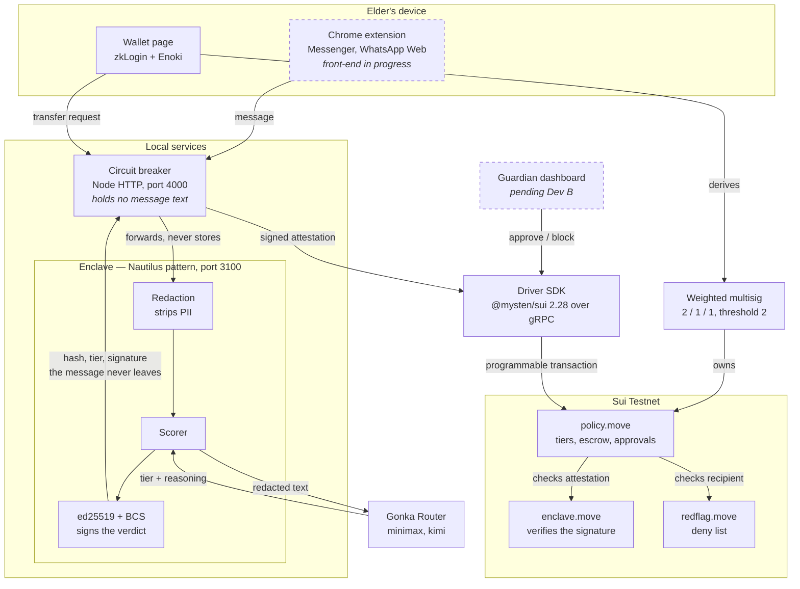

<div align="center">

# 守 SHOU

**S**cam-**H**alting **O**n-chain **U**tility

`守` — *shǒu*, to guard, to keep watch over.

**A stablecoin wallet whose owner writes her own spending rules while she is calm,
and the chain enforces them when she is not.**

MUBA Blockchain Hackathon 2026 · Sui Track 01 (Payments & Stablecoins) · Gonka (AI for Society)

</div>

---

## Executive summary

Elder financial scams are not a detection problem. They are an **authority** problem.

By the time money moves, the victim has usually already been warned — by a bank
notice, a pop-up, a relative. She sends it anyway, because a person she trusts is
on the phone telling her to, and in that moment she is the least capable person in
the world of overruling them. A warning does not stop a coerced person.

So the question is not *"how do we detect the scam?"* It is *"who has the authority
to stop the transfer?"* It cannot be the elder — she is being manipulated right now.
It cannot be her family — relatives are a leading vector for elder financial abuse.

**SHOU's answer: her own rules, pre-committed while she was calm, enforced where
nobody — not her family, not an attacker, not us — can quietly override them.**

It is two halves that only work together:

**A Chrome extension** sitting in the conversation where the scam actually happens —
Facebook and WhatsApp Web, the two channels Malaysian police name most often. It reads
messages as they arrive and scores them for the patterns that precede a transfer:
manufactured urgency, secrecy, impersonation, a request for money. **She does nothing.**
She does not install a scanner, run a check, or decide to be suspicious — which matters,
because a person who is being manipulated will not do any of those things. Detection has
to be passive or it does not happen at all.

**A wallet guardian** that turns that verdict into something with teeth. A red badge is
just another warning, and warnings do not stop a coerced person — so the risk score
flows into a spending policy she set in advance. Small amounts still move instantly.
Large ones, or ones during a flagged conversation, wait for someone she trusts.

The scoring runs inside a trusted execution environment, so the message never leaves it
— only a hash, a tier and a signature. The contract then treats that verdict as a
**floor, never a ceiling**: it can tighten her limits, never loosen them. Tell it a large
transfer is low-risk and it escalates anyway.

That is the whole thesis, and it is why you do not have to trust our model.

**Status:** the wallet guardian is deployed to Sui testnet and adversarially reviewed —
57 tests passing, five critical security bugs found and fixed, and a seven-step
end-to-end run that moves real testnet USDC. The scoring pipeline, redaction and
enclave are built and tested; **the Chrome extension front-end is in progress**. See
[docs/DECISIONS.md](docs/DECISIONS.md).

---

## Screenshots

> **TODO — add before submission.**

| | |
|---|---|
| `docs/img/01-signin.png` | zkLogin sign-in and the derived wallet address |
| `docs/img/02-risk.png` | A scam message scored, with truth score and Gonka request ID |
| `docs/img/03-escrow.png` | A transfer held in escrow, awaiting the guardian |
| `docs/img/04-dashboard.png` | *Guardian dashboard — pending Dev B* |
| `docs/img/05-extension.png` | *Chrome extension badge in a live chat — in progress* |
| `docs/img/06-terminal.png` | The escalation demo overruling the AI |

---

## Problem

**A disproportionate share of the money, from a shrinking share of the victims.**

- **United States (FBI IC3, 2024):** adults 60+ filed the most fraud complaints of any
  age group — 147,000+ — and reported **$4.8–4.9B in losses, up 43% year over year**.
  Crypto-related scams alone cost this group **$2.8B**. Average loss per victim:
  **$83,000**.
  [AARP](https://www.aarp.org/money/scams-fraud/fbi-report-fraud-2024/) ·
  [TRM Labs](https://www.trmlabs.com/resources/blog/a-record-breaking-year-for-cybercrime-key-findings-from-the-fbis-2024-ic3-report)

- **Malaysia (Bukit Aman):** senior citizens lost **RM552.5M to online scams between
  2021 and 2023** across 5,533 victims — fewer victims than other age groups, but a
  far larger loss each.
  [FMT](https://www.freemalaysiatoday.com/category/nation/2024/05/27/senior-citizens-lost-half-a-billion-ringgit-to-online-fraud-over-3-years)

- **2024 was the worst year in five.** RM40.6M in elderly financial-scam losses.
  Love scams targeting elderly women alone reached **RM45.9M**, up from RM43.9M in
  2023 — and **Facebook and WhatsApp are the two most common contact points**.
  [Malay Mail](https://www.malaymail.com/news/malaysia/2025/01/10/lonely-hearts-exploited-love-scams-prey-on-elderly-women-causing-rm459m-in-losses-in-2024-facebook-whatsapp-apps-of-choice-to-find-victims/162742)

The pattern in every one of these: the victim authorised the transfer herself. No
key was stolen. Existing defences target theft, and this is not theft — it is
consent, manufactured under pressure.

---

## Solution

**A Chrome extension that watches, and a wallet that listens to it.**

Neither half is useful alone. An extension that only shows a warning is one more
notification to dismiss — and the whole problem is that warnings do not stop someone
who is being talked through the transfer step by step. A wallet with spending limits
but no awareness of the conversation cannot tell a grocery payment from a scam.
Together, the conversation decides how the money behaves.

### What she experiences

1. A scam conversation starts in **Facebook Messenger or WhatsApp Web**. She does
   nothing differently.
2. The extension scores each message **as it arrives**. Nothing is installed, opened
   or checked by her. A quiet badge turns amber, then red.
3. She opens her wallet to send money — because she has been persuaded to, which is
   the entire point.
4. The wallet already knows the conversation was flagged. The transfer **does not
   fail; it waits**, and someone she trusts is asked.
5. Her son opens a message in plain English: *"Mum is trying to send $600 to an
   address she has never used, during a chat that looks like a scam."* He blocks it,
   and the money returns to her.

At no point did she have to suspect anything.

### The four layers

The middle two are the Sui submission; the outer two are the Gonka submission.

| Layer | What it does | Status |
|---|---|---|
| **0 · Detection** — *Chrome extension* | Reads the conversation in Messenger and WhatsApp Web, scores each message passively | Scoring, redaction and enclave complete; **extension front-end in progress** |
| **1 · Circuit breaker** | Correlates a flagged conversation with a transfer in the same session | Complete |
| **2 · Seniority Mode** — *wallet guardian* | On-chain tiered approval, cooldowns, guardian threshold, deny list | Complete, deployed |
| **3 · Red Flag reporting** | Community scam reporting with staff/oracle review | Contract complete; **review UI in progress** |

### Key features

**Her policy is the authority.** She sets the ceilings while calm. Small amounts
move instantly; medium amounts wait out a cooldown; large amounts need a guardian.

**The AI can only tighten, never loosen.** `submit_transfer` takes
`max_tier(amount_tier, reported_tier)`. This is the answer to *"what if your AI is
wrong, or compromised?"* — it cannot lower her limits, only raise them.

**Guardians can block, never redirect.** A guardian can stop a transfer and refund
it **to her**. There is no path by which a family member moves her money to
themselves. This matters because family members are a leading vector for elder
financial abuse.

**Non-custodial by construction, not by promise.** `AdminCap` appears nowhere in
`policy.move`. There is no code path by which we touch her funds — checkable in
source, not asserted in a pitch.

**The message never leaves the enclave.** Scoring happens inside a TEE. Only a hash,
a risk tier and a signature come out. PII is stripped before anything is scored, in
the client and again in the enclave.

**Recovery without handing over control.** zkLogin has no seed phrase and cannot be
exported, so funds sit behind a weighted multisig: she alone meets the threshold,
her son alone never does, two relatives together can recover.

---

## Tech stack, and why

| Layer | Technology | Why this one |
|---|---|---|
| Policy engine | **Sui Move**, 2024 edition | Shared objects let several people act on one wallet without anyone taking custody. Capabilities let us model "may block" separately from "may spend". |
| Asset | **Testnet USDC** | Elders think in dollars. A guard denominated in a volatile token protects nothing. |
| Client | **@mysten/sui 2.28**, `SuiGrpcClient` | JSON-RPC is deprecated on public fullnodes — we were on 1.45 and had to migrate mid-build. |
| Private compute | **Nautilus pattern**, ed25519 + BCS | The message is scored where nobody can read it; the chain verifies the enclave's signature itself. |
| Scoring | **Gonka Router** | Called from *inside* the enclave. If the extension called it directly the message would leave the device unprotected, and the privacy claim would be a promise rather than a property. |
| Sign-in | **zkLogin + Enoki** | An 80-year-old will not write down twelve words. |
| Recovery | **Weighted multisig** (2·1·1, threshold 2) | Weights, not counts — the only shape that lets her act alone while still allowing recovery. |

### How it fits together



The boundary that matters is the enclave box: **raw message text enters and never
comes back out.** Only a hash, a tier and a signature cross that line — which is why
Gonka is called from inside it rather than from the extension.

The second thing to read off the diagram: `policy.move` verifies the enclave's
signature *itself*, on-chain. The circuit breaker and driver carry the verdict but
cannot alter it, because any change invalidates the signature.

### Why Sui, honestly — the stub-it-out test

| Remove Sui. Does it still work? | |
|---|---|
| Gonka scoring, circuit breaker | Yes — which is why that is a separate track submission |
| Tiered approval, cooldown, deny list | **No.** This is the Track 01 submission |
| zkLogin | **No**, not without re-centralising custody in our own backend |

Three reasons the chain is load-bearing rather than decorative:

1. **The asset is already there.** Our user receives stablecoins because her family
   routes money that way — not because we chose to put a Web2 idea on-chain.
2. **Tamper-evidence a database cannot give.** A cooldown enforced in our backend is
   one `UPDATE` away from us quietly changing it. As a Move object, it is not — and
   "her pre-committed policy" is only credible if *even we* cannot bypass it.
3. **Non-custodial without the UX cost.** zkLogin is the one piece with no clean Web2
   equivalent: OAuth-simple sign-in *and* self-custody in one primitive.

---

## Track alignment

**Sui — Track 01, Payments & Stablecoins.** The track's own ideas list names
*"stablecoin wallets, treasury, escrow"*. `SeniorityPolicy` and `TransferRequest`
are a literal, undefended description of that: a stablecoin wallet with programmable
spending controls and on-chain escrow. Not "AI scam detection with a blockchain
attached" — a payments product whose risk layer happens to be AI.

**Gonka — AI for Society.** Conversation scoring and Red Flag evidence review both run
through Gonka Router as Layers 0 and 3, not as a bolt-on. Genuine public-value AI,
globally applicable, and the mechanism — *passive* detection rather than reactive
self-report — is the part that does not already exist.

**Deliberately decoupled.** Layers 0 and 3 need zero Sui code to demo; Layers 1 and 2
need zero Gonka calls, because the tier logic accepts a risk score regardless of who
produced it. Two submissions, two independently complete demos, from one build —
and neither has to defend an AI-blockchain entanglement that isn't real.

---

## Judging criteria — how we answer each one

### Sui, Track 01

**Commercial viability** — *weighted heaviest*

The buyer is the bank or e-wallet, not the elder, and the reason is a regulatory
change that happened last year rather than a market we hope will appear. Singapore's
Shared Responsibility Framework and the UK's PSR reimbursement rules made scam losses
a **direct balance-sheet cost** to financial institutions, with no liability cap in
Singapore. SHOU is the "real-time fraud surveillance plus cooling-off period" duty from
that framework, productised and sold per guarded account. A bank buys it to reduce
reimbursement exposure it now carries by law — not out of goodwill. Full detail in
[Business value](#business-value-and-revenue-model) below.

**Solves a real problem, and is ready for the real world**

Target user is specific: an elderly parent who receives money from family, most often
a working-abroad adult child, and is contacted through Facebook or WhatsApp — the two
channels Malaysian police name as the most common. The numbers are cited to primary
sources in [Problem](#problem). We do not claim readiness we do not have: the WhatsApp
production path is the Business API, not DOM scraping, and that is stated rather than
glossed.

**Technical implementation — complete over complex**

One vertical slice is finished end to end rather than four sketched:

- Deployed to testnet, **57 tests passing** (38 Move, 6 multisig, 7 redaction, 6 session)
- A **seven-step end-to-end run moving real testnet USDC**, not a mock
- **Five critical security bugs found and fixed** under adversarial review, each with a
  regression test — including a fund-theft bug in our own deployed contract, provable
  live: calling `policy::execute` directly now fails with `NonEntryFunctionInvoked`
- Every blocker and its resolution written down in [docs/DECISIONS.md](docs/DECISIONS.md)

**Product UX**

Sign-in is Google, not a seed phrase, because the user will not manage one. The
guardian sees plain English — *"someone you trust has to approve before any money
moves"* — never a tier number. Recovery is weighted so she is never dependent on a
relative for day-to-day spending. Where the model returns nothing, the screen says so
rather than inventing a confident-looking score.

**Presentation — let the judge visualise it**

The demo is three acts: sign in and score a live message; run the seven-step flow
against testnet; then **tell the contract a large transfer is safe and watch it refuse
anyway**. That last one is 45 seconds and needs no browser. Flow in
[docs/DEMO.md](docs/DEMO.md).

**Regulatory and compliance**

> **TODO — being researched by the team.** Drop findings here.
>
> Already documented: the Singapore and UK liability shifts (above); WhatsApp's ToS
> prohibiting automated access to the consumer client, with the Business API as the
> compliant production path; and the custody position — non-custodial by construction,
> since `AdminCap` appears nowhere in `policy.move`, which keeps us outside
> money-transmitter treatment.

### Gonka — AI for Society

**Solves a real problem, and is ready for the real world**

Same problem, same cited numbers. The AI does the part software is actually good at —
reading every message without getting tired — while the irreversible decision stays
with rules a human set in advance.

**Innovation and niche**

Three things we have not seen combined elsewhere:

1. **Passive detection, not self-report.** Every deployed tool requires the victim to
   suspect something and go check. A person being actively manipulated does not do
   that. Scoring runs on the conversation as it arrives.
2. **The AI's verdict is a floor, never a ceiling.** It can escalate a transfer; it can
   never de-escalate one. Almost every AI safety product fails open — ours cannot lower
   a limit the user set herself, so a wrong or compromised model degrades to "her own
   rules still apply" rather than to "approved".
3. **The model runs inside a TEE and signs its verdict**, which a blockchain then
   verifies independently. The privacy claim is a measurable property, not a promise:
   the message never leaves the enclave.

**Use of different models**

Not a model list — a **consensus rule**. Every configured model is queried in parallel
and the **strictest tier wins**, on the reasoning that one model missing a scam should
never be able to clear a transfer that another flagged. Each call's Gonka Request ID
is retained and rendered in the UI alongside the truth score and reasoning trace, in
the shape Gonka asks for.

> **Current status:** the Router is returning 404 for both models, so scoring falls back
> to a keyword heuristic that labels itself *"DEV MODE heuristic — not a real
> classifier"* on screen. The consensus logic is written and wired; the endpoint is not
> yet resolved. **Update this line once it is.**

---

## Business value and revenue model

**The buyer is the bank or e-wallet, not the elder.** Regulation turned elder-scam
losses from "sad, but not our liability" into a direct balance-sheet cost:

- **Singapore's Shared Responsibility Framework** (live 16 Dec 2024) — a bank bears
  the *full* scam loss if it breached a duty, including real-time fraud surveillance
  and a cooling-off period after new-device login. No liability cap.
  [MAS](https://www.mas.gov.sg/news/media-releases/2024/mas-and-imda-announce-implementation-of-shared-responsibility-framework-from-16-december-2024)
- **UK PSR APP fraud reimbursement** (live 7 Oct 2024) — sending and receiving banks
  split losses 50/50, mandatory reimbursement within 5 business days, up to £85,000
  per claim.
  [PSR](https://www.psr.org.uk/information-for-consumers/app-fraud-reimbursement-protections/)
- Malaysia's BNM is watching both models.

SHOU is the Singapore framework's "real-time fraud surveillance + cooling-off period"
duty, productised. A bank facing that liability now has a financial reason to pay for
a pre-transfer risk layer instead of eating the reimbursement afterwards.

**Primary — B2B2C SaaS.** License Seniority Mode and the circuit breaker as an
embeddable risk layer to a wallet or remittance app, priced per active guarded
account. Not a consumer subscription competing with free antivirus-style tools.

**Secondary — direct to consumer.** The diaspora-family case supports a guardian-pays
tier: an adult child working abroad pays a few dollars a month to protect a parent's
account. Same precedent as Life360, for money instead of location.

**Why now.** The liability shift is 2024–2025 and already live in two major
jurisdictions. This market did not financially exist for banks until last year.

---

## Future implementation

**Immediate, before this is production-credible**

- **Run the enclave on real AWS Nitro.** Signing and on-chain verification are already
  real; what is missing is the AWS attestation *document*, so key registration is
  currently admin-gated. Marked `PRODUCTION GAP` in the contract source.
- **Consume attestations once.** A signed verdict can currently be replayed inside its
  five-minute freshness window. Not exploitable today — every use still needs her
  signature, her coins, and passes the amount ceilings — but it must be closed before
  an attested LOW is ever allowed to skip escalation.
- **Enclave revocation.** A compromised key is currently valid forever.
- **Sponsored transactions** via Enoki, so a guardian can approve without holding gas.

**Product**

- **WhatsApp Business API** instead of reading the consumer client's DOM. Scraping
  WhatsApp Web violates its Terms of Service — fine for a self-hosted demo on our own
  accounts, not a viable production integration. Same detection logic, compliant
  message source.
- Bank and e-wallet pilot against the Singapore framework's duty list.
- Localisation for the scam scripts that actually circulate in Malaysia and Singapore.

---

## Repository

| | |
|---|---|
| [docs/DECISIONS.md](docs/DECISIONS.md) | Technology choices, design decisions, and every blocker with how it was resolved |
| [docs/RUNBOOK.md](docs/RUNBOOK.md) | Ports, startup order, and what to do when something breaks |
| [docs/DEMO.md](docs/DEMO.md) | The demo flow, and which gaps to raise before a judge finds them |
| [docs/shou-architecture.md](docs/shou-architecture.md) | Module design and the developer split |
| [docs/shou-idea.md](docs/shou-idea.md) | Full PRD |
| [shou/move/](shou/move/) | The Move contracts — `policy`, `redflag`, `enclave` |
| [shou/enclave/](shou/enclave/) | The TEE service |
| [shou/packages/](shou/packages/) | Driver, circuit breaker, redaction, Gonka client |

### Quick start

```bash
cd shou/enclave                   && SHOU_TEST_SCORER=1 npm start   # :3100
cd shou/packages/circuit-breaker  && npm start                      # :4000
cd shou/packages/zklogin-demo     && npm start                      # :3000
```

Then the two demos that need no browser:

```bash
node --experimental-strip-types packages/driver/src/e2e.ts               # 7 steps, real USDC
node --experimental-strip-types packages/driver/src/demo-escalation.ts   # the AI is overruled
```

Full setup, including `.env` names, is in [docs/RUNBOOK.md](docs/RUNBOOK.md) and
[shou/.env.example](shou/.env.example).

---

## Honest limitations

We would rather state these than have them found:

- **No Nitro instance.** Signature verification is real; the key's provenance is
  currently asserted by us rather than proven by AWS hardware.
- **Gonka Router is returning 404** at time of writing, so scoring falls back to a
  keyword heuristic that labels itself *"DEV MODE heuristic — not a real classifier"*
  on screen. The architecture is unaffected; the model call is not.
- **The Chrome extension front-end and guardian dashboard are still in progress.** The
  scoring pipeline behind them — redaction, enclave, consensus, attestation — is built
  and tested.
- **WhatsApp DOM reading is demo-only** and not ToS-compliant for production.

---

## Team

**Hana** — Overall planning, Move contracts, TEE enclave, driver SDK, zkLogin and recovery.
**Shermaine** — Gonka Router integration, Chrome extension, guardian dashboard.
**Daniel and Yi Wen** - Research, business and financial value, target users, statistics, rules and regulatory, existing competitors
