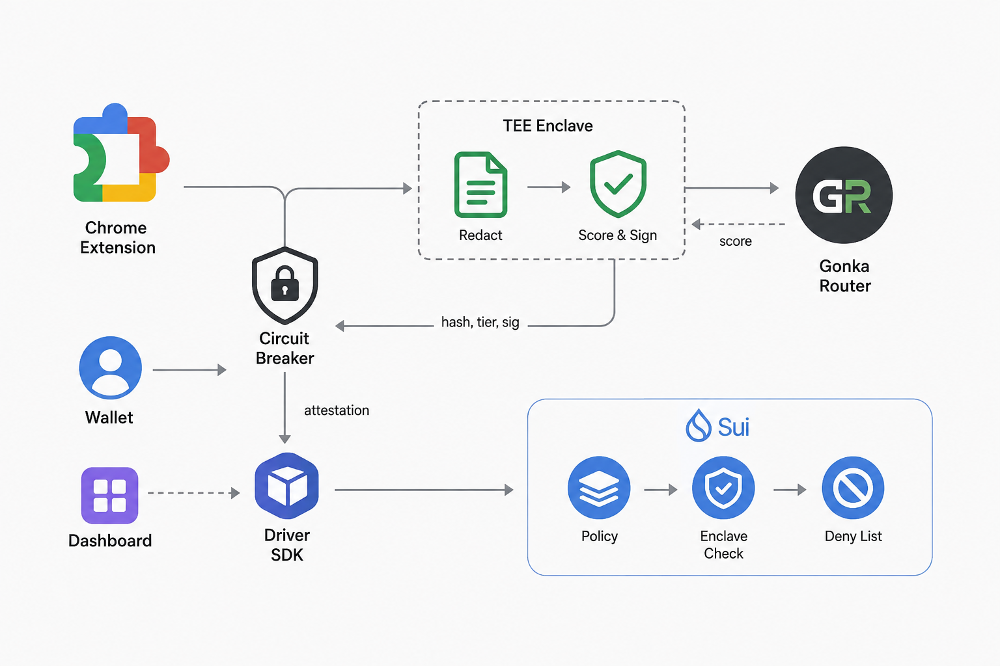

<div align="center">

# 守 SHOU

**S**cam-**H**alting **O**n-chain **U**tility

`守` — *shǒu*, to guard, to keep watch over.

**A stablecoin wallet whose owner writes her own spending rules while she is calm,
and the chain enforces them when she is not.**

MUBA Blockchain Hackathon 2026 · Sui Track 01 (Payments & Stablecoins) · Gonka (AI for Society)

</div>

---

## Executive summary

Elder financial scams are not a detection problem but an **authority** problem: by the
time money moves the victim has usually already been warned, and sends it anyway
because someone she trusts is telling her to. That authority cannot rest with her —
she is being manipulated right now — nor with her family, who are a leading vector for
elder financial abuse, so it rests with rules she set while calm. SHOU pairs a **Chrome
extension** that passively scores her conversations inside a TEE with an **on-chain
policy** that decides how her money behaves, and the AI's verdict is a floor rather
than a ceiling — it can tighten her limits, never loosen them. Tell the contract a
large transfer is low-risk and it escalates anyway, which is why you do not have to
trust our model.

**Status:** wallet guardian deployed to Sui testnet — 91 tests passing, five critical
security bugs found and fixed, a seven-step end-to-end run in real USDC. Scoring,
redaction, the enclave, the Chrome extension and the guardian dashboard are all built.
([details](docs/DECISIONS.md))

---

## Screenshots

> **TODO — add before submission.**

| | |
|---|---|
| `docs/img/01-signin.png` | zkLogin sign-in and the derived wallet address |
| `docs/img/02-risk.png` | A scam message scored, with truth score and Gonka request ID |
| `docs/img/03-escrow.png` | A transfer held in escrow, awaiting the guardian |
| `docs/img/04-dashboard.png` | A held transfer on the guardian dashboard, with the chain's escalation shown |
| `docs/img/05-extension.png` | Chrome extension badge in a live chat, and the popup's Truth Score and Request IDs |
| `docs/img/06-terminal.png` | The escalation demo overruling the AI |

---

## Problem

**A disproportionate share of the money, from a shrinking share of the victims.**

- **United States (FBI IC3, 2024):** adults 60+ filed the most fraud complaints of any
  age group — 147,000+ — and reported **$4.8–4.9B in losses, up 43% year over year**.
  Crypto-related scams alone cost this group **$2.8B**. Average loss per victim:
  **$83,000**.
  [AARP](https://www.aarp.org/money/scams-fraud/fbi-report-fraud-2024/) ·
  [TRM Labs](https://www.trmlabs.com/resources/blog/a-record-breaking-year-for-cybercrime-key-findings-from-the-fbis-2024-ic3-report)

- **Malaysia (Bukit Aman):** senior citizens lost **RM552.5M to online scams between
  2021 and 2023** across 5,533 victims — fewer victims than other age groups, but a
  far larger loss each.
  [FMT](https://www.freemalaysiatoday.com/category/nation/2024/05/27/senior-citizens-lost-half-a-billion-ringgit-to-online-fraud-over-3-years)

- **2024 was the worst year in five.** RM40.6M in elderly financial-scam losses.
  Love scams targeting elderly women alone reached **RM45.9M**, up from RM43.9M in
  2023 — and **Facebook and WhatsApp are the two most common contact points**.
  [Malay Mail](https://www.malaymail.com/news/malaysia/2025/01/10/lonely-hearts-exploited-love-scams-prey-on-elderly-women-causing-rm459m-in-losses-in-2024-facebook-whatsapp-apps-of-choice-to-find-victims/162742)

The pattern in every one of these: the victim authorised the transfer herself. No
key was stolen. Existing defences target theft, and this is not theft — it is
consent, manufactured under pressure.

---

## Solution

**A Chrome extension and wallet guardian that protect passively, not reactively.**

An extension that only warns is one more notification to dismiss. A wallet with
spending limits but no awareness of the conversation cannot tell groceries from a
scam. Together, the conversation decides how the money behaves.

**1 · Passive detection.** The extension reads the on-screen chat DOM in WhatsApp Web
and Messenger automatically — no copy-pasting, no button to press — and shows an
inline 🟢/🟡/🔴 badge. Every message goes to a Gonka Router classifier, then to a
second model for cross-verification if the shared deadline allows, and
**deterministic rules set floors that no model is permitted to talk down**.

**2 · Private and tamper-evident.** Inference runs inside a TEE, so message content is
never exposed to operators — only a hash, a tier and a signature leave, and PII is
stripped before scoring. That hash is anchored on-chain inside the signed attestation,
so a verdict cannot be altered afterwards without invalidating the signature.

**3 · Behavioural circuit breaker into Seniority Mode.** When a live flagged
conversation correlates with an unusual payment, the transfer does not fail — it
**waits**, and high-risk transfers require trusted-family co-approval, enforced as an
on-chain Sui policy rather than by our backend. Reported scammers get a **soft ban**
that blocks suspicious amounts while still allowing daily necessities.

**4 · Safe by construction.** The AI's verdict is a floor, never a ceiling. Guardians
can block a transfer and refund it **to her**, but never redirect it to themselves.
`AdminCap` appears nowhere in `policy.move`, so there is no code path by which we touch
her funds — and because zkLogin has no seed phrase, funds sit behind a weighted
multisig where she acts alone, her son alone cannot, and two relatives together can
recover.

Layers 1–2 are the Sui submission; layers 0 and 3 are the Gonka submission. The Red
Flag evidence-review UI is the one piece still in progress; the extension and the
dashboard are built.

---

## User flow

Every path starts the same way: she does nothing differently, and the extension scores
each message as it arrives.

| Scenario | What happens |
|---|---|
| Clean chat, small amount | 🟢 → she sends → executes immediately |
| Clean chat, over her review ceiling | 🟢 → she sends → cooldown → executes |
| **Scam chat** | 🔴 → she sends → escrowed, `NEEDS_APPROVAL` → son notified → he blocks → **refunded to her** |
| Scam chat, guardian says it's fine | 🔴 → escrowed → son approves → executes |
| **She insists** | Escrowed → she retries → refused, `EThresholdNotMet` → wait for guardian, or cancel → refunded |
| Guardian never responds | Escrowed → she cancels → refunded. Funds are never stranded |
| **AI wrong or compromised** | Says 🟢 on a large amount → chain escalates to HIGH anyway → needs guardian |
| No chat was scored | No verdict → her amount ceilings apply on their own |
| Recipient reported as a scammer | Deny list hit → large amounts blocked, daily necessities still allowed |

The model can tighten, never loosen. And SHOU is a guardrail, not a cage: you cannot be
non-custodial *and* make it impossible to spend your own money.

---

## Tech stack

| Layer | Technology | Why this one |
|---|---|---|
| Policy engine | **Sui Move**, 2024 edition | Shared objects let several people act on one wallet without anyone taking custody. Capabilities let us model "may block" separately from "may spend". |
| Asset | **Testnet USDC** | Elders think in dollars. A guard denominated in a volatile token protects nothing. |
| Client | **@mysten/sui 2.28**, `SuiGrpcClient` | JSON-RPC is deprecated on public fullnodes — we were on 1.45 and had to migrate mid-build. |
| Private compute | **Nautilus pattern**, ed25519 + BCS | The message is scored where nobody can read it; the chain verifies the enclave's signature itself. |
| Scoring | **Gonka Router** | Called from *inside* the enclave. If the extension called it directly the message would leave the device unprotected, and the privacy claim would be a promise rather than a property. |
| Sign-in | **zkLogin + Enoki** | An 80-year-old will not write down twelve words. |
| Recovery | **Weighted multisig** (2·1·1, threshold 2) | Weights, not counts — the only shape that lets her act alone while still allowing recovery. |

### How it fits together



The dashed box is the trust boundary. Raw message text goes in; only a hash, a tier and
a signature come out — which is why Gonka is called from *inside* it rather than from the
extension. `policy.move` then verifies that signature on-chain itself, so the circuit
breaker and driver carry the verdict but cannot alter it.

Everything in this diagram is built and running; the Red Flag evidence-review UI is
the one piece still in progress.

### Project structure

```
muba2026/
├── README.md
├── docs/                       DECISIONS · RUNBOOK · DEMO · architecture · PRD
└── shou/
    ├── move/
    │   ├── sources/            policy.move · redflag.move · enclave.move
    │   └── tests/              38 Move tests
    ├── enclave/src/            TEE server, attestation, BCS layout
    └── packages/
        ├── driver/             Sui SDK client, e2e + demo scripts, shared interface
        ├── circuit-breaker/    correlates conversation risk with transfers
        ├── gonka-client/       classifier + verifier scorer, deterministic floors
        ├── redact/             PII stripping
        ├── extension/          Chrome extension — passive DOM scoring, inline badge
        ├── dashboard/          guardian dashboard — approve or block a held transfer
        └── zklogin-demo/       sign-in, recovery multisig, transfer panel
```

The seam between developers is `packages/driver/src/types.ts` — the interface the
dashboard and extension code against.

---

## Track alignment

**Sui — Track 01.** The track's ideas list names *"stablecoin wallets, treasury,
escrow"*. `SeniorityPolicy` and `TransferRequest` are a literal description of that —
a stablecoin wallet with programmable controls, not AI with a blockchain attached.

**Gonka — AI for Society.** Conversation scoring and Red Flag evidence review are
Layers 0 and 3, not a bolt-on. Passive detection instead of reactive self-report is
the part that does not already exist.

**Deliberately decoupled.** Layers 0 and 3 need zero Sui code to demo; Layers 1 and 2
need zero Gonka calls, because the tier logic accepts a risk score regardless of who
produced it. Two submissions, two complete demos, one build.

---

## Judging criteria — how we answer each one

### Sui, Track 01

**Commercial viability** — *weighted heaviest*

The buyer is the bank or e-wallet, not the elder, and the reason is a regulatory
change that happened last year rather than a market we hope will appear. Singapore's
Shared Responsibility Framework and the UK's PSR reimbursement rules made scam losses
a **direct balance-sheet cost** to financial institutions, with no liability cap in
Singapore. SHOU is the "real-time fraud surveillance plus cooling-off period" duty from
that framework, productised and sold per guarded account. A bank buys it to reduce
reimbursement exposure it now carries by law — not out of goodwill. Full detail in
[Business value](#business-value-and-revenue-model) below.

**Solves a real problem, and is ready for the real world**

Target user is specific: an elderly parent who receives money from family, most often
a working-abroad adult child, and is contacted through Facebook or WhatsApp — the two
channels Malaysian police name as the most common. The numbers are cited to primary
sources in [Problem](#problem). We do not claim readiness we do not have: the WhatsApp
production path is the Business API, not DOM scraping, and that is stated rather than
glossed.

**Technical implementation — complete over complex**

One vertical slice is finished end to end rather than four sketched:

- Deployed to testnet, **91 tests passing** (38 Move, 6 multisig, 7 redaction, 6 session,
  22 extension, 12 scoring), and `shou/verify.sh` runs all of them plus the live
  scoring path in one command
- A **seven-step end-to-end run moving real testnet USDC**, not a mock
- **Five critical security bugs found and fixed** under adversarial review, each with a
  regression test — including a fund-theft bug in our own deployed contract, provable
  live: calling `policy::execute` directly now fails with `NonEntryFunctionInvoked`
- Every blocker and its resolution written down in [docs/DECISIONS.md](docs/DECISIONS.md)

**Product UX**

Sign-in is Google, not a seed phrase, because the user will not manage one. The
guardian sees plain English — *"someone you trust has to approve before any money
moves"* — never a tier number. Recovery is weighted so she is never dependent on a
relative for day-to-day spending. Where the model returns nothing, the screen says so
rather than inventing a confident-looking score.

**Presentation — let the judge visualise it**

The demo is three acts: sign in and score a live message; run the seven-step flow
against testnet; then **tell the contract a large transfer is safe and watch it refuse
anyway**. That last one is 45 seconds and needs no browser. Flow in
[docs/DEMO.md](docs/DEMO.md).

**Regulatory and compliance**

> **TODO — being researched by the team.** Drop findings here.
>
> Already documented: the Singapore and UK liability shifts (above); WhatsApp's ToS
> prohibiting automated access to the consumer client, with the Business API as the
> compliant production path; and the custody position — non-custodial by construction,
> since `AdminCap` appears nowhere in `policy.move`, which keeps us outside
> money-transmitter treatment.

### Gonka — AI for Society

**Solves a real problem, and is ready for the real world**

Same problem, same cited numbers. The AI does the part software is actually good at —
reading every message without getting tired — while the irreversible decision stays
with rules a human set in advance.

**Innovation and niche**

Three things we have not seen combined elsewhere:

1. **Passive detection, not self-report.** Every deployed tool requires the victim to
   suspect something and go check. A person being actively manipulated does not do
   that. Scoring runs on the conversation as it arrives.
2. **The AI's verdict is a floor, never a ceiling.** It can escalate a transfer; it can
   never de-escalate one. Almost every AI safety product fails open — ours cannot lower
   a limit the user set herself, so a wrong or compromised model degrades to "her own
   rules still apply" rather than to "approved".
3. **The model runs inside a TEE and signs its verdict**, which a blockchain then
   verifies independently. The privacy claim is a measurable property, not a promise:
   the message never leaves the enclave.

**Use of different models**

Not a model list, and not a vote — **two models in distinct roles, with code owning
the final number.**

**DeepSeek-V4-Flash is the classifier** (median 2.6s), and **MiniMax-M2.7 is a
skeptical second reviewer** (median 19.6s) that sees the same redacted message but not
the classifier's answer, so a gap between them is real disagreement rather than
anchoring. Both calls share one **14-second wall-clock deadline**, because a user is
watching a badge: if under 4s remain when the classifier returns, the second opinion is
skipped and the output says *"not cross-verified"* rather than spending the rest of the
budget and returning nothing.

**The calls are sequential, deliberately.** Issued concurrently this router returns
HTTP 429, and when it does not 429 it throttles — the same DeepSeek call measured
2,472ms alone and 17,560ms alongside one other request. Parallelism costs roughly 7x
here and buys nothing, so the obvious `Promise.all` shape is exactly wrong.

**Code computes the score, not a model.** A weighted blend (classifier 0.35, verifier
0.2, deterministic indicators 0.2) renormalises over whoever actually answered, so a
model that fails drops out instead of dragging the average toward zero. Over that sit
**hard floors no model can lower**: a credential request floors at 85, the
authority + urgency + secrecy signature of a Macau scam at 80, authority + urgency at
70. And if *every* model fails, anything scoring above 15 on deterministic rules alone
is raised to 40 — the MEDIUM line — so an outage holds a transfer for review instead of
silently clearing it.

Every state that is not a clean two-model run is **named on screen**: `not
cross-verified`, `classifier unavailable`, `the two models disagreed by N points`,
`held for review rather than cleared, because no model was available`. Each call's
Gonka Request ID is retained and rendered in the UI beside the Truth Score and the
reasoning trace, in the shape Gonka asks for.

> **Kimi-K2.6 is deliberately not in the live path.** It was excluded on measured
> latency — median 26.5s, never once under 23s across five novel prompts, against a
> 14-second deadline. Re-checked on 3 Sep 2026 it no longer answers this router at all:
> a bare *"reply ok"* prompt returned **HTTP 524 after 126s**, and a 60s attempt
> returned nothing. Two models is the deliberate shape, not an unfinished three. Figures
> are recorded at the top of
> [packages/gonka-client/src/scorer.ts](shou/packages/gonka-client/src/scorer.ts); the
> wider latency investigation is in
> [shermaine-gonka/LATENCY-FINDINGS.md](shermaine-gonka/LATENCY-FINDINGS.md).

---

## Business value and revenue model

**The buyer is the bank or e-wallet, not the elder.** Regulation turned elder-scam
losses from "sad, but not our liability" into a direct balance-sheet cost:

- **Singapore's Shared Responsibility Framework** (live 16 Dec 2024) — a bank bears
  the *full* scam loss if it breached a duty, including real-time fraud surveillance
  and a cooling-off period after new-device login. No liability cap.
  [MAS](https://www.mas.gov.sg/news/media-releases/2024/mas-and-imda-announce-implementation-of-shared-responsibility-framework-from-16-december-2024)
- **UK PSR APP fraud reimbursement** (live 7 Oct 2024) — sending and receiving banks
  split losses 50/50, mandatory reimbursement within 5 business days, up to £85,000
  per claim.
  [PSR](https://www.psr.org.uk/information-for-consumers/app-fraud-reimbursement-protections/)
- Malaysia's BNM is watching both models.

SHOU is the Singapore framework's "real-time fraud surveillance + cooling-off period"
duty, productised. A bank facing that liability now has a financial reason to pay for
a pre-transfer risk layer instead of eating the reimbursement afterwards.

**Primary — B2B2C SaaS.** License Seniority Mode and the circuit breaker as an
embeddable risk layer to a wallet or remittance app, priced per active guarded
account. Not a consumer subscription competing with free antivirus-style tools.

**Secondary — direct to consumer.** The diaspora-family case supports a guardian-pays
tier: an adult child working abroad pays a few dollars a month to protect a parent's
account. Same precedent as Life360, for money instead of location.

**Why now.** The liability shift is 2024–2025 and already live in two major
jurisdictions. This market did not financially exist for banks until last year.

---

## Future implementation

**Immediate, before this is production-credible**

- **Run the enclave on real AWS Nitro.** Signing and on-chain verification are already
  real; what is missing is the AWS attestation *document*, so key registration is
  currently admin-gated. Marked `PRODUCTION GAP` in the contract source.
- **Consume attestations once.** A signed verdict can currently be replayed inside its
  five-minute freshness window. Not exploitable today — every use still needs her
  signature, her coins, and passes the amount ceilings — but it must be closed before
  an attested LOW is ever allowed to skip escalation.
- **Enclave revocation.** A compromised key is currently valid forever.
- **Sponsored transactions** via Enoki, so neither the elder nor the guardian holds SUI.
  Confirmed with Mysten: sponsorship is configured per *app*, not per user, so one setup
  covers both roles and the guardian's approval stays an ordinary on-chain call. The
  guardian signs in with Enoki zkLogin rather than connecting a wallet. Open point: the
  elder's funds sit at a multisig address containing a zkLogin member, and we still need
  to confirm sponsorship covers a multisig sender.

**Product**

- **WhatsApp Business API** instead of reading the consumer client's DOM. Scraping
  WhatsApp Web violates its Terms of Service — fine for a self-hosted demo on our own
  accounts, not a viable production integration. Same detection logic, compliant
  message source.
- Bank and e-wallet pilot against the Singapore framework's duty list.
- Localisation for the scam scripts that actually circulate in Malaysia and Singapore.

---

## Running it

```bash
cd shou/enclave                   && SHOU_TEST_SCORER=1 npm start   # :3100
cd shou/packages/circuit-breaker  && npm start                      # :4000
cd shou/packages/zklogin-demo     && npm start                      # :3000
cd shou/packages/dashboard        && npm start                      # :4200  guardian
cd shou/packages/extension        && npm run build                  # then load unpacked
```

The extension loads from `chrome://extensions` → Developer mode → **Load unpacked** →
`shou/packages/extension/dist`. Open its Settings and press *Fetch policy id from
dashboard*; it refuses to score without one rather than filing verdicts under a
placeholder policy.

The two demos that need no browser:

```bash
node --experimental-strip-types packages/driver/src/e2e.ts             # 7 steps, real USDC
node --experimental-strip-types packages/driver/src/demo-escalation.ts # the AI is overruled
```

Setup, ports and failure modes: [docs/RUNBOOK.md](docs/RUNBOOK.md) ·
demo script: [docs/DEMO.md](docs/DEMO.md) ·
decisions and blockers: [docs/DECISIONS.md](docs/DECISIONS.md) ·
env names: [shou/.env.example](shou/.env.example)

---

## Honest limitations

We would rather state these than have them found:

- **No Nitro instance.** Signature verification is real; the key's provenance is
  currently asserted by us rather than proven by AWS hardware.
- **Only two of the three models are in the live path.** DeepSeek classifies and
  MiniMax cross-verifies; Kimi is excluded on measured latency (median 26.5s against a
  14-second deadline), not on quality. A second opinion is also skipped whenever the
  classifier leaves under 4s of budget, and the UI says so when that happens rather
  than implying two models agreed.
- **The offline heuristic is still reachable without credentials.** With no
  `GONKA_API_KEY`, or with `SHOU_TEST_SCORER=1`, scoring falls back to a keyword
  stand-in that labels itself *"DEV MODE heuristic — not a real classifier"* on screen.
  It is a test fixture, not a detector, and nothing claims otherwise on screen.
- **The first message scored after an idle period will miss the deadline.** This
  router pays a large one-off cold-start penalty: measured on 3 Sep 2026, DeepSeek took
  26.7s cold, then 0.68s for the same prompt and 1.79s for a novel one. So a cold first
  call exceeds the 14-second deadline and the verdict falls to deterministic rules,
  labelled `classifier unavailable` on screen. **Warm the router before demoing.**
- **The 14-second deadline is marginal against this router's current latency, not
  comfortable.** In one warm run a full two-model assessment finished in 6.4s with both
  Request IDs returned; in another, minutes later, the classifier alone exceeded 14s. In
  both cases the deterministic floors held the scam at HIGH and the UI said it was
  degraded — the safety net is doing exactly what it is for, but it is carrying more of
  the load than the design intends.
- **The extension's DOM selectors are the fragile part of the build.** Both WhatsApp Web
  and Messenger ship obfuscated, frequently-changing class names. They are isolated in
  one file with a diagnostic that names which half broke, and the logic layered on top
  is unit-tested, but the selectors themselves cannot be tested without shipping a
  snapshot of someone else's markup. Messenger is the weaker of the two — it has no
  stable equivalent of WhatsApp's `message-in`, so incoming is inferred from the row's
  accessible label.
- **The guardian dashboard signs with a local keypair, not zkLogin.** Every approval is
  a real on-chain call, but in production the guardian would sign in with Enoki and the
  server would be static hosting. It binds to `127.0.0.1` for that reason.
- **The Red Flag evidence-review UI is not built.** `redflag.move` and
  `reportRedFlag()` are, and are tested.
- **WhatsApp DOM reading is demo-only** and not ToS-compliant for production.

---

## Team

**Hana** — Overall planning, Move contracts, TEE enclave, driver SDK, zkLogin and recovery.
**Shermaine** — Gonka Router integration, Chrome extension, guardian dashboard.
**Daniel and Yi Wen** - Research, business and financial value, target users, statistics, rules and regulatory, existing competitors
